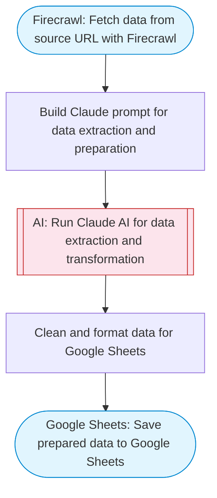

# Data preparation and transformation pipeline

Fetches raw data from a URL, uses a code step to transform, clean, and normalize the data into the correct format, and saves the prepared data to Google Sheets.

> **Works with any AI agent.** Paste this page's URL into Claude Code, Codex, Cursor, Windsurf, OpenClaw, or any coding agent — it will read the docs, connect your platforms, and run this flow for you.

## Quick Start

```bash
# 1. Connect your platforms (one-time setup)
one add firecrawl
one add google-sheets

# 2. Run the flow
one flow execute n8n-1748-preparing-data-service \
  --input dataUrl="https://example.com" \
  --input fieldMapping="..."
```

## Platforms

| Platform | Used for |
|----------|----------|
| Firecrawl | Fetching url data |
| Google Sheets | Connection key |

> Don't have these connected yet? Run `one list` to check, then `one add <platform>` to connect.

## What it does

1. Fetch data from source URL with Firecrawl
2. Build Claude prompt for data extraction and preparation
3. Run Claude AI for data extraction and transformation
4. Clean and format data for Google Sheets
5. Save prepared data to Google Sheets

## Flow diagram



## Inputs

| Input | Required | Description |
|-------|----------|-------------|
| `dataUrl` | Yes | URL to fetch data from (e.g. a page with tabular data, listings, or a data feed) |
| `fieldMapping` | No | Optional field mapping instructions (e.g. 'rename name to Full Name, drop age column, add timestamp') |

---

<sub>Based on [n8n #1748](https://n8n.io/workflows/1748) · 64.8K views on n8n · by [jon-n8n](https://n8n.io/creators/jon-n8n) · Converted to One CLI on 2026-03-25</sub>
