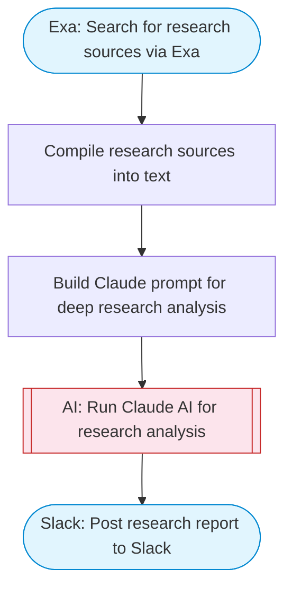

# AI research assistant with Exa and Claude

A private AI research assistant that takes a topic, searches for relevant sources via Exa, uses Claude for deep analysis and synthesis, and posts a comprehensive research summary to Slack with Block Kit formatting.

> **Works with any AI agent.** Paste this page's URL into Claude Code, Codex, Cursor, Windsurf, OpenClaw, or any coding agent — it will read the docs, connect your platforms, and run this flow for you.

## Quick Start

```bash
# 1. Connect your platforms (one-time setup)
one add exa
one add slack

# 2. Run the flow
one flow execute n8n-2729-private-ai-assistant \
  --input topic="your topic here" \
  --input depth="..." \
  --input slackChannel="C01ABC123" \
  --input numResults="..."
```

## Platforms

| Platform | Used for |
|----------|----------|
| Exa | Web research |
| Slack | Posting results |

> Don't have these connected yet? Run `one list` to check, then `one add <platform>` to connect.

## What it does

1. Search for research sources via Exa
2. Compile research sources into text
3. Build Claude prompt for deep research analysis
4. Run Claude AI for research analysis
5. Post research report to Slack

## Flow diagram



## Inputs

| Input | Required | Description |
|-------|----------|-------------|
| `topic` | Yes | The research topic or question to investigate |
| `depth` | No | Research depth: 'quick' (5 sources), 'standard' (10), or 'deep' (15) (default: standard) |
| `slackChannel` | Yes | Slack channel ID to post the research summary |
| `numResults` | No | Number of Exa search results to fetch (default: 10) |

---

<sub>Based on [n8n #2729](https://n8n.io/workflows/2729) · 63.0K views on n8n · by [joe](https://n8n.io/creators/joe) · Converted to One CLI on 2026-03-25</sub>
