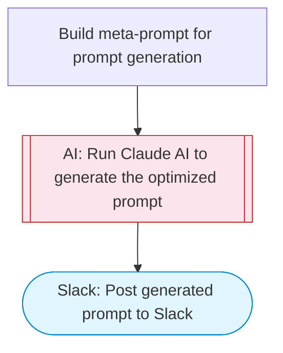

# AI prompt generator: create optimized prompts for any task

Takes a rough task description, uses Claude AI to generate an optimized, structured prompt with clear instructions, examples, and output format. Posts the generated prompt to Slack with Block Kit formatting for easy copy-paste.

> **Works with any AI agent.** Paste this page's URL into Claude Code, Codex, Cursor, Windsurf, OpenClaw, or any coding agent — it will read the docs, connect your platforms, and run this flow for you.

## Quick Start

```bash
# 1. Connect your platforms (one-time setup)
one add slack

# 2. Run the flow
one flow execute n8n-5045-prompt-generator \
  --input slackChannel="C01ABC123" \
  --input taskDescription="..." \
  --input targetModel="..." \
  --input outputFormat="..." \
  --input additionalRequirements="..."
```

## Platforms

| Platform | Used for |
|----------|----------|
| Slack | Posting the generated prompt |

> Don't have these connected yet? Run `one list` to check, then `one add <platform>` to connect.

## What it does

1. Build meta-prompt for prompt generation
2. Run Claude AI to generate the optimized prompt
3. Post generated prompt to Slack

## Flow diagram



## Inputs

| Input | Required | Description |
|-------|----------|-------------|
| `slackChannel` | Yes | Slack channel ID to post the prompt |
| `taskDescription` | Yes | Rough description of the task you need a prompt for (e.g. 'Write product descriptions for an e-commerce site', 'Analyze customer reviews for sentiment') |
| `targetModel` | No | Target AI model: Claude, GPT-4, Gemini, general (default: Claude) |
| `outputFormat` | No | Desired output format: structured (JSON), narrative (text), code, mixed (default: structured) |
| `additionalRequirements` | No | Additional requirements or constraints for the prompt (e.g. 'must be under 500 tokens', 'include few-shot examples') (default: ) |

---

<sub>Based on [n8n #5045](https://n8n.io/workflows/5045) · 52.1K views on n8n · by [anuragmerndev](https://n8n.io/creators/anuragmerndev) · Converted to One CLI on 2026-03-25</sub>
