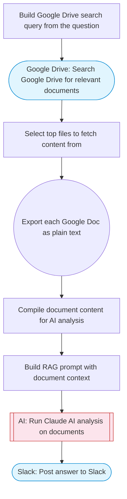

# RAG chatbot for company documents using Google Drive and Gemini

A RAG-style chatbot that answers employee questions using company documents stored in Google Drive. Searches Drive for relevant files, exports their content as plain text, and uses Claude to synthesize an accurate answer grounded in the document content. Results are posted to Slack with Block Kit formatting.

> **Works with any AI agent.** Paste this page's URL into Claude Code, Codex, Cursor, Windsurf, OpenClaw, or any coding agent — it will read the docs, connect your platforms, and run this flow for you.

## Quick Start

```bash
# 1. Connect your platforms (one-time setup)
one add google-drive
one add slack

# 2. Run the flow
one flow execute n8n-2753-rag-chatbot-company \
  --input question="your question here" \
  --input folderId="..." \
  --input slackChannel="C01ABC123"
```

## Platforms

| Platform | Used for |
|----------|----------|
| Google Drive | Connection key |
| Slack | Posting results |

> Don't have these connected yet? Run `one list` to check, then `one add <platform>` to connect.

## What it does

1. Build Google Drive search query from the question
2. Search Google Drive for relevant documents
3. Select top files to fetch content from
4. Export each Google Doc as plain text
5. Compile document content for AI analysis
6. Build RAG prompt with document context
7. Run Claude AI analysis on documents
8. Post answer to Slack

## Flow diagram



## Inputs

| Input | Required | Description |
|-------|----------|-------------|
| `question` | Yes | The employee's question about company documents |
| `folderId` | No | Google Drive folder ID to search within (optional — searches all files if omitted) |
| `slackChannel` | Yes | Slack channel ID to post the answer |

---

<sub>Based on [n8n #2753](https://n8n.io/workflows/2753) · 284.3K views on n8n · by [mihailtd](https://n8n.io/creators/mihailtd) · Converted to One CLI on 2026-03-24</sub>
