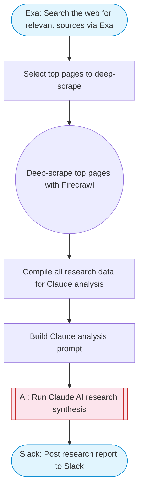

# AI Web Research Agent

Takes a research question, uses Exa to search the web for relevant sources, Firecrawl to scrape the most promising pages, and Claude AI to synthesize findings into a structured research report with citations. Posts the report to Slack using Block Kit formatting.

> **Works with any AI agent.** Paste this page's URL into Claude Code, Codex, Cursor, Windsurf, OpenClaw, or any coding agent — it will read the docs, connect your platforms, and run this flow for you.

## Quick Start

```bash
# 1. Connect your platforms (one-time setup)
one add exa
one add firecrawl
one add slack

# 2. Run the flow
one flow execute n8n-2006-rag-google-drive \
  --input question="your question here" \
  --input depth="..." \
  --input slackChannel="C01ABC123"
```

## Platforms

| Platform | Used for |
|----------|----------|
| Exa | Search the web for relevant sources via Exa |
| Firecrawl | Web scraping |
| Slack | Post research report to Slack |

> Don't have these connected yet? Run `one list` to check, then `one add <platform>` to connect.

## What it does

1. Search the web for relevant sources via Exa
2. Select top pages to deep-scrape
3. Deep-scrape top pages with Firecrawl
4. Compile all research data for Claude analysis
5. Build Claude analysis prompt
6. Run Claude AI research synthesis
7. Post research report to Slack

## Flow diagram



## Inputs

| Input | Required | Description |
|-------|----------|-------------|
| `question` | Yes | Research question to investigate (e.g. 'What are the latest advances in quantum computing error correction?') |
| `depth` | No | Number of pages to deep-scrape (1-5) (default: 3) |
| `slackChannel` | Yes | Slack channel ID to post the research report |

---

<sub>Based on [n8n #2006](https://n8n.io/workflows/2006) · 277.5K views on n8n · by [eduard](https://n8n.io/creators/eduard) · Converted to One CLI on 2026-03-24</sub>
