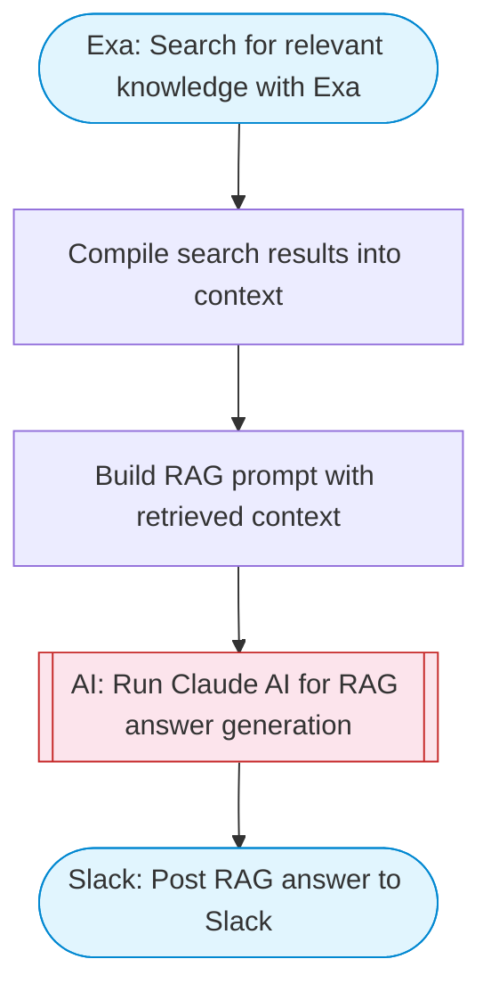

# RAG knowledge retrieval with Exa and Claude

Takes a user question, performs knowledge retrieval using Exa web search, feeds the retrieved context to Claude AI for a grounded answer, and posts the response to Slack with source citations.

> **Works with any AI agent.** Paste this page's URL into Claude Code, Codex, Cursor, Windsurf, OpenClaw, or any coding agent — it will read the docs, connect your platforms, and run this flow for you.

## Quick Start

```bash
# 1. Connect your platforms (one-time setup)
one add exa
one add slack

# 2. Run the flow
one flow execute n8n-2465-rag-starter-template \
  --input slackChannel="C01ABC123" \
  --input question="your question here" \
  --input numResults="..."
```

## Platforms

| Platform | Used for |
|----------|----------|
| Exa | Web search |
| Slack | Post RAG answer to Slack |

> Don't have these connected yet? Run `one list` to check, then `one add <platform>` to connect.

## What it does

1. Search for relevant knowledge with Exa
2. Compile search results into context
3. Build RAG prompt with retrieved context
4. Run Claude AI for RAG answer generation
5. Post RAG answer to Slack

## Flow diagram



## Inputs

| Input | Required | Description |
|-------|----------|-------------|
| `slackChannel` | Yes | Slack channel to post the answer |
| `question` | Yes | The question to answer using RAG retrieval |
| `numResults` | No | Number of Exa search results to retrieve (default: 5) |

---

<sub>Based on [n8n #2465](https://n8n.io/workflows/5010) · 95.1K views on n8n · by [jimleuk](https://n8n.io/creators/jimleuk) · Converted to One CLI on 2026-03-25</sub>
