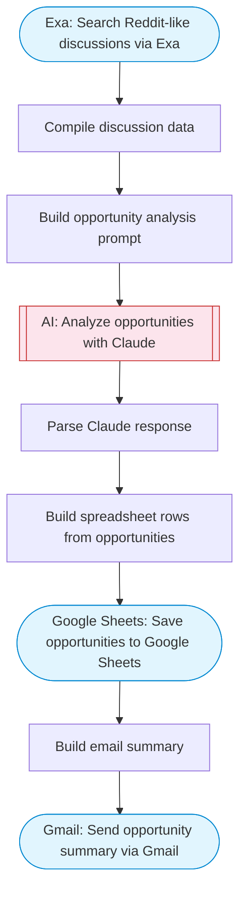

# Reddit Business Opportunity Analyzer

Search Reddit-like discussions via Exa, use Claude AI to identify viable business opportunities, save results to Google Sheets, and send a summary email via Gmail.

> **Works with any AI agent.** Paste this page's URL into Claude Code, Codex, Cursor, Windsurf, OpenClaw, or any coding agent — it will read the docs, connect your platforms, and run this flow for you.

## Quick Start

```bash
# 1. Connect your platforms (one-time setup)
one add exa
one add google-sheets
one add gmail

# 2. Run the flow
one flow execute n8n-2978-reddit-biz-opportunities \
  --input searchQuery="your question here" \
  --input spreadsheetId="..." \
  --input sheetName="..." \
  --input recipientEmail="user@example.com" \
  --input industry="B2B SaaS"
```

## Platforms

| Platform | Used for |
|----------|----------|
| Exa | Search Reddit-like discussions via Exa |
| Google Sheets | Save opportunities to Google Sheets |
| Gmail | Send opportunity summary via Gmail |

> Don't have these connected yet? Run `one list` to check, then `one add <platform>` to connect.

## What it does

1. Search Reddit-like discussions via Exa
2. Compile discussion data
3. Build opportunity analysis prompt
4. Analyze opportunities with Claude
5. Parse Claude response
6. Build spreadsheet rows from opportunities
7. Save opportunities to Google Sheets
8. Build email summary
9. Send opportunity summary via Gmail

## Flow diagram



## Inputs

| Input | Required | Description |
|-------|----------|-------------|
| `searchQuery` | Yes | Search query for Reddit discussions (e.g. 'frustrated with project management tools', 'looking for better CRM') |
| `spreadsheetId` | Yes | Google Sheets spreadsheet ID to save opportunities |
| `sheetName` | No | Sheet tab name (default: Opportunities) |
| `recipientEmail` | Yes | Email address to send the opportunity summary |
| `industry` | No | Target industry focus (e.g. 'SaaS', 'e-commerce', 'health tech') (default: ) |

---

<sub>Based on [n8n #2978](https://n8n.io/workflows/2978) · 32.9K views on n8n · by [tao](https://n8n.io/creators/tao) · Converted to One CLI on 2026-03-25</sub>
