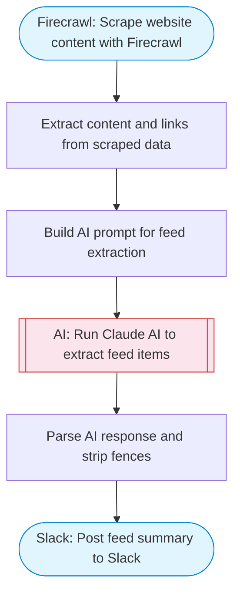

# RSS Feed Generator — Firecrawl Scrape + AI Extraction to Slack

Scrapes a website with Firecrawl to extract its content, uses Claude AI to identify articles and updates, formats them as a structured feed summary, and posts it to Slack.

> **Works with any AI agent.** Paste this page's URL into Claude Code, Codex, Cursor, Windsurf, OpenClaw, or any coding agent — it will read the docs, connect your platforms, and run this flow for you.

## Quick Start

```bash
# 1. Connect your platforms (one-time setup)
one add firecrawl
one add slack

# 2. Run the flow
one flow execute n8n-1418-rss-feed-generator \
  --input slackChannel="C01ABC123" \
  --input websiteUrl="https://example.com" \
  --input feedTitle="..."
```

## Platforms

| Platform | Used for |
|----------|----------|
| Firecrawl | Scrape website content with Firecrawl |
| Slack | Post feed summary to Slack |

> Don't have these connected yet? Run `one list` to check, then `one add <platform>` to connect.

## What it does

1. Scrape website content with Firecrawl
2. Extract content and links from scraped data
3. Build AI prompt for feed extraction
4. Run Claude AI to extract feed items
5. Parse AI response and strip fences
6. Post feed summary to Slack

## Flow diagram



## Inputs

| Input | Required | Description |
|-------|----------|-------------|
| `slackChannel` | Yes | Slack channel ID to post the feed summary |
| `websiteUrl` | Yes | Website URL to scrape for articles/updates (e.g. 'https://techcrunch.com') |
| `feedTitle` | No | Title for the feed summary (default: Website Feed) |

---

<sub>Based on [n8n #1418](https://n8n.io/workflows/1418) · 44.6K views on n8n · by [mutedjam](https://n8n.io/creators/mutedjam) · Converted to One CLI on 2026-03-25</sub>
