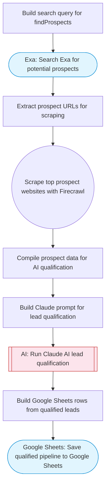

# Sales cold calling pipeline with AI qualification

Finds prospects via Exa web search, scrapes their websites with Firecrawl for detailed company data, Claude AI qualifies and scores each lead, then saves the qualified pipeline to Google Sheets. Adapted from n8n's Apify GPT-4o cold calling pipeline workflow.

> **Works with any AI agent.** Paste this page's URL into Claude Code, Codex, Cursor, Windsurf, OpenClaw, or any coding agent — it will read the docs, connect your platforms, and run this flow for you.

## Quick Start

```bash
# 1. Connect your platforms (one-time setup)
one add exa
one add firecrawl
one add google-sheets

# 2. Run the flow
one flow execute n8n-194-sales-cold-calling-pipeline \
  --input targetIndustry="B2B SaaS" \
  --input targetLocation="San Francisco" \
  --input spreadsheetId="..." \
  --input sheetName="..." \
  --input idealCustomerProfile="..."
```

## Platforms

| Platform | Used for |
|----------|----------|
| Exa | Prospect discovery |
| Firecrawl | Website scraping |
| Google Sheets | Saving the pipeline |

> Don't have these connected yet? Run `one list` to check, then `one add <platform>` to connect.

## What it does

1. Build search query for findProspects
2. Search Exa for potential prospects
3. Extract prospect URLs for scraping
4. Scrape top prospect websites with Firecrawl
5. Compile prospect data for AI qualification
6. Build Claude prompt for lead qualification
7. Run Claude AI lead qualification
8. Save qualified pipeline to Google Sheets

## Flow diagram



## Inputs

| Input | Required | Description |
|-------|----------|-------------|
| `targetIndustry` | Yes | Target industry or vertical for prospect search (e.g., 'SaaS startups', 'e-commerce brands') |
| `targetLocation` | No | Geographic target for prospects (default: United States) |
| `spreadsheetId` | Yes | Google Sheets spreadsheet ID for the sales pipeline |
| `sheetName` | No | Sheet tab name for the pipeline data (default: Pipeline) |
| `idealCustomerProfile` | Yes | Description of ideal customer profile (e.g., 'B2B companies with 50-500 employees, using outdated CRM') |

---

<sub>Based on [n8n #194](https://n8n.io/workflows/194) · 31.7K views on n8n · Converted to One CLI on 2026-03-25</sub>
