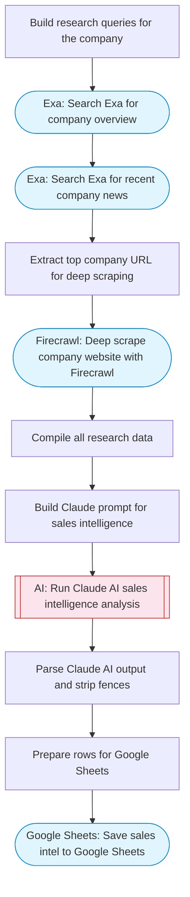

# AI Sales Web Researcher

Takes a company name, uses Exa for web search and Firecrawl for deep scraping of company pages, Claude AI builds comprehensive sales intelligence including company overview, key contacts, pain points, and talking points, then saves the intel to Google Sheets.

> **Works with any AI agent.** Paste this page's URL into Claude Code, Codex, Cursor, Windsurf, OpenClaw, or any coding agent — it will read the docs, connect your platforms, and run this flow for you.

## Quick Start

```bash
# 1. Connect your platforms (one-time setup)
one add exa
one add firecrawl
one add google-sheets

# 2. Run the flow
one flow execute n8n-2324-sales-web-researcher \
  --input spreadsheetId="..." \
  --input sheetName="..." \
  --input companyName="..." \
  --input industry="B2B SaaS"
```

## Platforms

| Platform | Used for |
|----------|----------|
| Exa | Web search |
| Firecrawl | Deep scraping |
| Google Sheets | Saving intel |

> Don't have these connected yet? Run `one list` to check, then `one add <platform>` to connect.

## What it does

1. Build research queries for the company
2. Search Exa for company overview
3. Search Exa for recent company news
4. Extract top company URL for deep scraping
5. Deep scrape company website with Firecrawl
6. Compile all research data
7. Build Claude prompt for sales intelligence
8. Run Claude AI sales intelligence analysis
9. Parse Claude AI output and strip fences
10. Prepare rows for Google Sheets
11. Save sales intel to Google Sheets

## Flow diagram



## Inputs

| Input | Required | Description |
|-------|----------|-------------|
| `spreadsheetId` | Yes | Google Sheets spreadsheet ID to save sales research |
| `sheetName` | No | Sheet tab name (default: 'Sales Intel') (default: Sales Intel) |
| `companyName` | Yes | Target company name to research (e.g. 'Stripe', 'Notion') |
| `industry` | No | Industry context for better research (e.g. 'fintech', 'SaaS') |

---

<sub>Based on [n8n #2324](https://n8n.io/workflows/2324) · 77.9K views on n8n · by [lucasperret](https://n8n.io/creators/lucasperret) · Converted to One CLI on 2026-03-25</sub>
