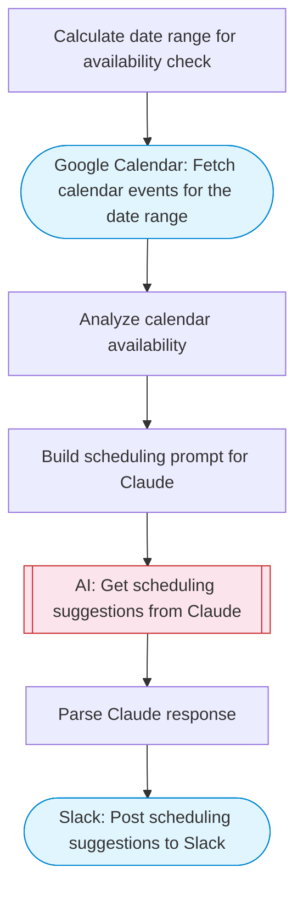

# AI Scheduling Assistant

Check Google Calendar availability, use Claude AI to suggest optimal meeting slots, and post scheduling recommendations to Slack. Adapted from the Voiceflow phone agent template for calendar-focused scheduling.

> **Works with any AI agent.** Paste this page's URL into Claude Code, Codex, Cursor, Windsurf, OpenClaw, or any coding agent — it will read the docs, connect your platforms, and run this flow for you.

## Quick Start

```bash
# 1. Connect your platforms (one-time setup)
one add google-calendar
one add slack

# 2. Run the flow
one flow execute n8n-3657-scheduling-assistant \
  --input slackChannel="C01ABC123" \
  --input meetingRequest="..." \
  --input lookAheadDays="..." \
  --input workingHoursStart="..." \
  --input workingHoursEnd="..."
```

## Platforms

| Platform | Used for |
|----------|----------|
| Google Calendar | Fetch calendar events for the date range |
| Slack | Post scheduling suggestions to Slack |

> Don't have these connected yet? Run `one list` to check, then `one add <platform>` to connect.

## What it does

1. Calculate date range for availability check
2. Fetch calendar events for the date range
3. Analyze calendar availability
4. Build scheduling prompt for Claude
5. Get scheduling suggestions from Claude
6. Parse Claude response
7. Post scheduling suggestions to Slack

## Flow diagram



## Inputs

| Input | Required | Description |
|-------|----------|-------------|
| `slackChannel` | Yes | Slack channel ID to post scheduling suggestions |
| `meetingRequest` | Yes | Describe the meeting you need to schedule (e.g. '1-hour team sync with marketing next week') |
| `lookAheadDays` | No | Number of business days to look ahead for availability (default: 5) |
| `workingHoursStart` | No | Working hours start (24h format, e.g. 9) (default: 9) |
| `workingHoursEnd` | No | Working hours end (24h format, e.g. 17) (default: 17) |

---

<sub>Based on [n8n #3657](https://n8n.io/workflows/3657) · 33.0K views on n8n · by [n3witalia](https://n8n.io/creators/n3witalia) · Converted to One CLI on 2026-03-25</sub>
