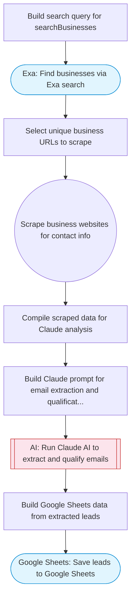

# Business Email Finder

Takes a business type and location, uses Exa to find relevant businesses, Firecrawl to scrape their websites for contact information, and Claude AI to extract and qualify email addresses with business context. Saves qualified leads to Google Sheets.

> **Works with any AI agent.** Paste this page's URL into Claude Code, Codex, Cursor, Windsurf, OpenClaw, or any coding agent — it will read the docs, connect your platforms, and run this flow for you.

## Quick Start

```bash
# 1. Connect your platforms (one-time setup)
one add exa
one add firecrawl
one add google-sheets

# 2. Run the flow
one flow execute n8n-2567-scrape-business-emails \
  --input businessType="..." \
  --input location="San Francisco" \
  --input maxResults="10"
```

## Platforms

| Platform | Used for |
|----------|----------|
| Exa | Find businesses via Exa search |
| Firecrawl | Web scraping |
| Google Sheets | Connection key |

> Don't have these connected yet? Run `one list` to check, then `one add <platform>` to connect.

## What it does

1. Build search query for searchBusinesses
2. Find businesses via Exa search
3. Select unique business URLs to scrape
4. Scrape business websites for contact info
5. Compile scraped data for Claude analysis
6. Build Claude prompt for email extraction and qualification
7. Run Claude AI to extract and qualify emails
8. Save leads to Google Sheets

## Flow diagram



## Inputs

| Input | Required | Description |
|-------|----------|-------------|
| `businessType` | Yes | Type of business to find (e.g. 'dentist', 'restaurant', 'plumber', 'real estate agent') |
| `location` | Yes | City, region, or area to search (e.g. 'Austin, TX', 'London, UK') |
| `maxResults` | No | Maximum number of businesses to scrape (1-20) (default: 10) |

---

<sub>Based on [n8n #2567](https://n8n.io/workflows/2567) · 207.2K views on n8n · by [akramkadri](https://n8n.io/creators/akramkadri) · Converted to One CLI on 2026-03-24</sub>
