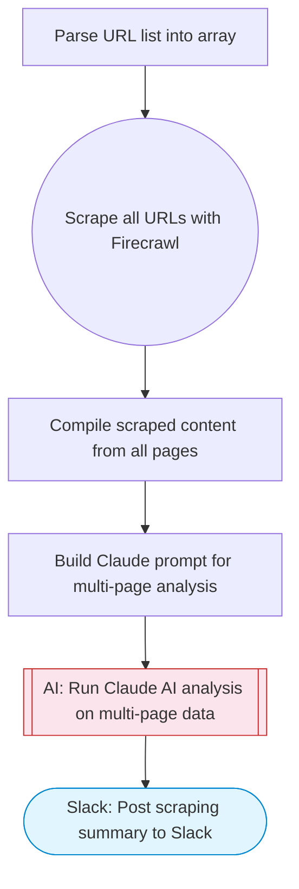

# Scrape and store data from multiple website pages

Scrapes multiple URLs with Firecrawl in a loop, uses Claude AI to compile and analyze the extracted data, and posts a structured summary to Slack using Block Kit formatting.

> **Works with any AI agent.** Paste this page's URL into Claude Code, Codex, Cursor, Windsurf, OpenClaw, or any coding agent — it will read the docs, connect your platforms, and run this flow for you.

## Quick Start

```bash
# 1. Connect your platforms (one-time setup)
one add firecrawl
one add slack

# 2. Run the flow
one flow execute n8n-1073-scrape-store-data \
  --input urls="https://example.com" \
  --input slackChannel="C01ABC123" \
  --input extractionGoal="..."
```

## Platforms

| Platform | Used for |
|----------|----------|
| Firecrawl | Web scraping |
| Slack | Post scraping summary to Slack |

> Don't have these connected yet? Run `one list` to check, then `one add <platform>` to connect.

## What it does

1. Parse URL list into array
2. Scrape all URLs with Firecrawl
3. Compile scraped content from all pages
4. Build Claude prompt for multi-page analysis
5. Run Claude AI analysis on multi-page data
6. Post scraping summary to Slack

## Flow diagram



## Inputs

| Input | Required | Description |
|-------|----------|-------------|
| `urls` | Yes | Comma-separated list of URLs to scrape (e.g. 'https://example.com/page1,https://example.com/page2') |
| `slackChannel` | Yes | Slack channel to post the scraping summary |
| `extractionGoal` | No | What kind of data to extract from the pages (default: Extract all structured data, key facts, and notable information) |

---

<sub>Based on [n8n #1073](https://n8n.io/workflows/1073) · 103.7K views on n8n · by [mcolomer](https://n8n.io/creators/mcolomer) · Converted to One CLI on 2026-03-24</sub>
