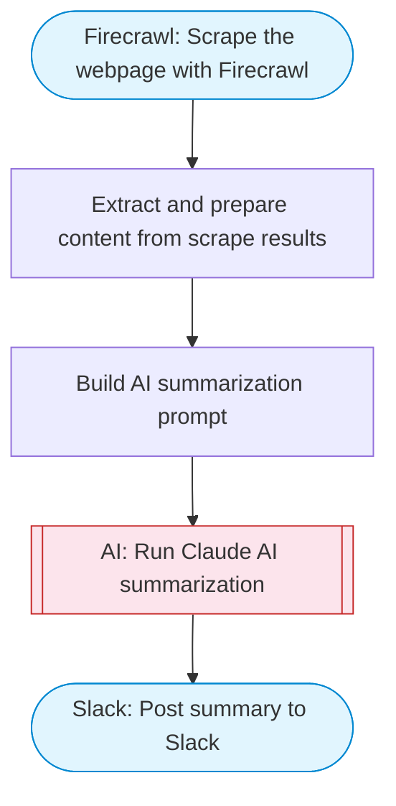

# Scrape and summarize webpages with AI

Scrapes a webpage using Firecrawl to extract its content, then uses Claude to generate a structured summary with key takeaways, and delivers the result to Slack with rich Block Kit formatting.

> **Works with any AI agent.** Paste this page's URL into Claude Code, Codex, Cursor, Windsurf, OpenClaw, or any coding agent — it will read the docs, connect your platforms, and run this flow for you.

## Quick Start

```bash
# 1. Connect your platforms (one-time setup)
one add firecrawl
one add slack

# 2. Run the flow
one flow execute n8n-1951-scrape-summarize-webpages \
  --input url="https://example.com" \
  --input slackChannel="C01ABC123"
```

## Platforms

| Platform | Used for |
|----------|----------|
| Firecrawl | Web scraping |
| Slack | Posting results |

> Don't have these connected yet? Run `one list` to check, then `one add <platform>` to connect.

## What it does

1. Scrape the webpage with Firecrawl
2. Extract and prepare content from scrape results
3. Build AI summarization prompt
4. Run Claude AI summarization
5. Post summary to Slack

## Flow diagram



## Inputs

| Input | Required | Description |
|-------|----------|-------------|
| `url` | Yes | URL of the webpage to scrape and summarize |
| `slackChannel` | Yes | Slack channel ID to post the summary |

---

<sub>Based on [n8n #1951](https://n8n.io/workflows/1951) · 380.0K views on n8n · by [n8n-team](https://n8n.io/creators/n8n-team) · Converted to One CLI on 2026-03-24</sub>
