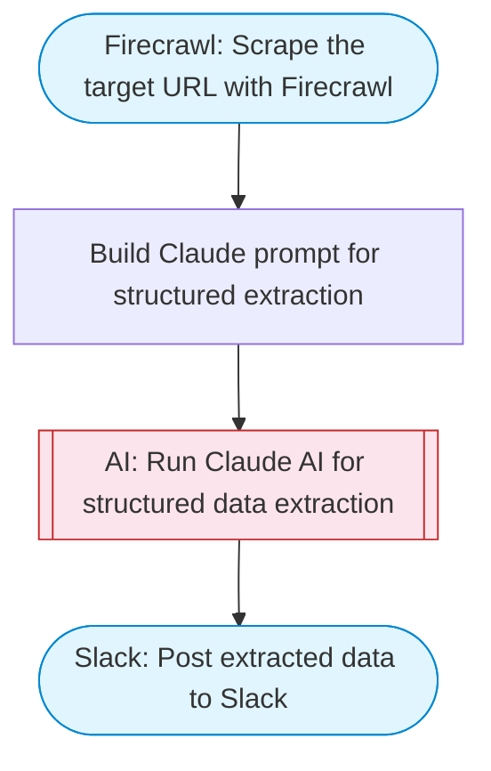

# Structured web scraper with AI

Scrapes any web page using Firecrawl, uses Claude to extract structured JSON data based on a user-defined schema, and posts the extracted data to Slack with Block Kit formatting.

> **Works with any AI agent.** Paste this page's URL into Claude Code, Codex, Cursor, Windsurf, OpenClaw, or any coding agent — it will read the docs, connect your platforms, and run this flow for you.

## Quick Start

```bash
# 1. Connect your platforms (one-time setup)
one add firecrawl
one add slack

# 2. Run the flow
one flow execute n8n-2812-scrape-web-structured-json \
  --input url="https://example.com" \
  --input schema="..." \
  --input slackChannel="C01ABC123"
```

## Platforms

| Platform | Used for |
|----------|----------|
| Firecrawl | Web scraping |
| Slack | Posting results |

> Don't have these connected yet? Run `one list` to check, then `one add <platform>` to connect.

## What it does

1. Scrape the target URL with Firecrawl
2. Build Claude prompt for structured extraction
3. Run Claude AI for structured data extraction
4. Post extracted data to Slack

## Flow diagram



## Inputs

| Input | Required | Description |
|-------|----------|-------------|
| `url` | Yes | URL to scrape (e.g. 'https://news.ycombinator.com') |
| `schema` | Yes | Description of the data structure to extract (e.g. 'Extract product listings with: title, price, rating, description, image URL') |
| `slackChannel` | Yes | Slack channel ID to post the extracted data |

---

<sub>Based on [n8n #2812](https://n8n.io/workflows/2812) · 65.4K views on n8n · by [scrapeninja](https://n8n.io/creators/scrapeninja) · Converted to One CLI on 2026-03-25</sub>
