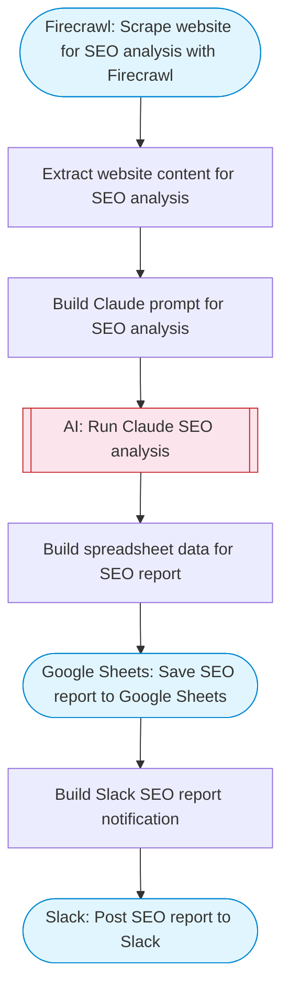

# Export search console results to Google Sheets with AI analysis

Scrapes a website with Firecrawl to identify SEO content, uses Claude AI to analyze search performance patterns and generate SEO recommendations, saves structured reports to Google Sheets, and notifies Slack with key findings.

> **Works with any AI agent.** Paste this page's URL into Claude Code, Codex, Cursor, Windsurf, OpenClaw, or any coding agent — it will read the docs, connect your platforms, and run this flow for you.

## Quick Start

```bash
# 1. Connect your platforms (one-time setup)
one add firecrawl
one add google-sheets
one add slack

# 2. Run the flow
one flow execute n8n-2613-search-console-to-sheets \
  --input websiteUrl="https://example.com" \
  --input slackChannel="C01ABC123" \
  --input focusKeywords="..."
```

## Platforms

| Platform | Used for |
|----------|----------|
| Firecrawl | Website scraping |
| Google Sheets | Seo reports |
| Slack | Notifications |

> Don't have these connected yet? Run `one list` to check, then `one add <platform>` to connect.

## What it does

1. Scrape website for SEO analysis with Firecrawl
2. Extract website content for SEO analysis
3. Build Claude prompt for SEO analysis
4. Run Claude SEO analysis
5. Build spreadsheet data for SEO report
6. Save SEO report to Google Sheets
7. Build Slack SEO report notification
8. Post SEO report to Slack

## Flow diagram



## Inputs

| Input | Required | Description |
|-------|----------|-------------|
| `websiteUrl` | Yes | Website domain to analyze (e.g. 'https://example.com') |
| `slackChannel` | Yes | Slack channel for SEO report delivery |
| `focusKeywords` | No | Comma-separated target keywords to focus on (default: ) |

---

<sub>Based on [n8n #2613](https://n8n.io/workflows/2613) · 26.4K views on n8n · by [imperolq](https://n8n.io/creators/imperolq) · Converted to One CLI on 2026-03-25</sub>
