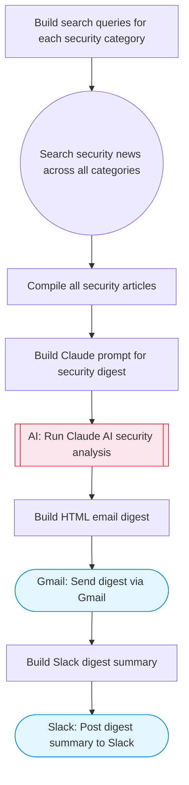

# AI Security & Compliance News Digest

Searches for the latest security, privacy, and compliance news via Exa, uses Claude AI to categorize, summarize, and prioritize the articles, then sends a formatted HTML digest via Gmail and posts a summary to Slack. Adapted from n8n's intelligent AI digest for security feeds.

> **Works with any AI agent.** Paste this page's URL into Claude Code, Codex, Cursor, Windsurf, OpenClaw, or any coding agent — it will read the docs, connect your platforms, and run this flow for you.

## Quick Start

```bash
# 1. Connect your platforms (one-time setup)
one add exa
one add gmail
one add slack

# 2. Run the flow
one flow execute n8n-4678-security-digest-email \
  --input emailRecipient="user@example.com" \
  --input slackChannel="C01ABC123" \
  --input categories="..." \
  --input focusKeywords="..."
```

## Platforms

| Platform | Used for |
|----------|----------|
| Exa | Security news search |
| Gmail | Sending the digest |
| Slack | Posting summary |

> Don't have these connected yet? Run `one list` to check, then `one add <platform>` to connect.

## What it does

1. Build search queries for each security category
2. Search security news across all categories
3. Compile all security articles
4. Build Claude prompt for security digest
5. Run Claude AI security analysis
6. Build HTML email digest
7. Send digest via Gmail
8. Build Slack digest summary
9. Post digest summary to Slack

## Flow diagram



## Inputs

| Input | Required | Description |
|-------|----------|-------------|
| `emailRecipient` | Yes | Email address to send the daily digest |
| `slackChannel` | Yes | Slack channel for the digest summary |
| `categories` | No | Comma-separated security categories to track (default: cybersecurity, data privacy, compliance, vulnerabilities) |
| `focusKeywords` | No | Specific keywords to prioritize (e.g. 'GDPR, SOC 2, ransomware') (default: ) |

---

<sub>Based on [n8n #4678](https://n8n.io/workflows/4678) · 20.2K views on n8n · by [niranjan](https://n8n.io/creators/niranjan) · Converted to One CLI on 2026-03-25</sub>
