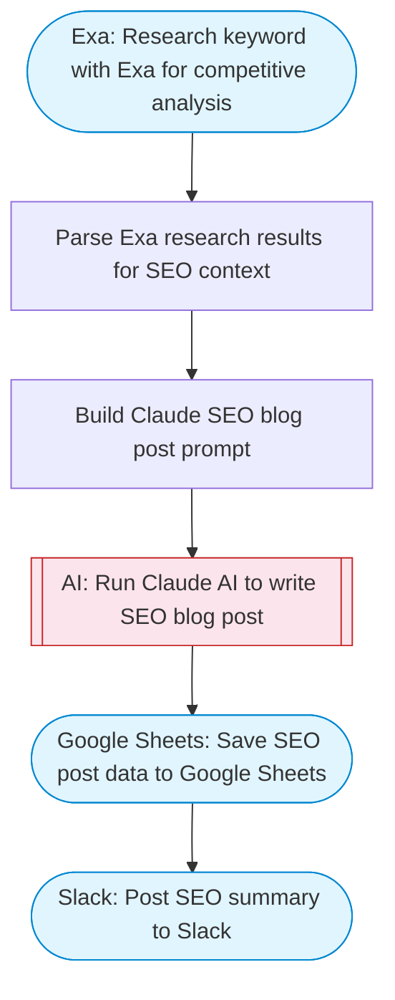

# SEO Blog Posts — Exa Keyword Research + Claude Writing + Sheets Tracking

Uses Exa for keyword research and competitive analysis, Claude AI to write SEO-optimized blog posts with proper headings and meta tags, and saves the results to Google Sheets for content tracking.

> **Works with any AI agent.** Paste this page's URL into Claude Code, Codex, Cursor, Windsurf, OpenClaw, or any coding agent — it will read the docs, connect your platforms, and run this flow for you.

## Quick Start

```bash
# 1. Connect your platforms (one-time setup)
one add exa
one add google-sheets
one add slack

# 2. Run the flow
one flow execute n8n-6067-seo-blog-posts \
  --input slackChannel="C01ABC123" \
  --input spreadsheetUrl="https://example.com" \
  --input sheetName="..." \
  --input keyword="..." \
  --input targetWordCount="..."
```

## Platforms

| Platform | Used for |
|----------|----------|
| Exa | Keyword research |
| Google Sheets | Saving posts |
| Slack | Notifications |

> Don't have these connected yet? Run `one list` to check, then `one add <platform>` to connect.

## What it does

1. Research keyword with Exa for competitive analysis
2. Parse Exa research results for SEO context
3. Build Claude SEO blog post prompt
4. Run Claude AI to write SEO blog post
5. Save SEO post data to Google Sheets
6. Post SEO summary to Slack

## Flow diagram



## Inputs

| Input | Required | Description |
|-------|----------|-------------|
| `slackChannel` | Yes | Slack channel ID for post notifications |
| `spreadsheetUrl` | Yes | Google Sheets URL to save generated posts (columns: Date, Keyword, Title, MetaDescription, WordCount, Status) |
| `sheetName` | No | Sheet tab name (default: Sheet1) |
| `keyword` | Yes | Target SEO keyword or topic (e.g. 'best project management tools 2025') |
| `targetWordCount` | No | Target word count for the blog post (default: 1500) |

---

<sub>Based on [n8n #6067](https://n8n.io/workflows/6067) · 39.2K views on n8n · by [cristiantala](https://n8n.io/creators/cristiantala) · Converted to One CLI on 2026-03-25</sub>
