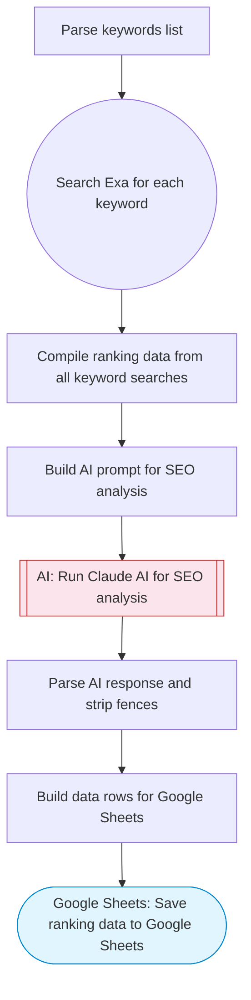

# SEO Keyword Tracker — Exa Research + AI Analysis to Sheets

Searches for ranking content around target keywords via Exa, uses Claude AI to analyze keyword positions and competitive landscape, and saves the structured analysis to Google Sheets.

> **Works with any AI agent.** Paste this page's URL into Claude Code, Codex, Cursor, Windsurf, OpenClaw, or any coding agent — it will read the docs, connect your platforms, and run this flow for you.

## Quick Start

```bash
# 1. Connect your platforms (one-time setup)
one add exa
one add google-sheets

# 2. Run the flow
one flow execute n8n-5962-seo-keyword-tracker \
  --input keywords="..." \
  --input domain="..."
```

## Platforms

| Platform | Used for |
|----------|----------|
| Exa | Web search |
| Google Sheets | Save ranking data to Google Sheets |

> Don't have these connected yet? Run `one list` to check, then `one add <platform>` to connect.

## What it does

1. Parse keywords list
2. Search Exa for each keyword
3. Compile ranking data from all keyword searches
4. Build AI prompt for SEO analysis
5. Run Claude AI for SEO analysis
6. Parse AI response and strip fences
7. Build data rows for Google Sheets
8. Save ranking data to Google Sheets

## Flow diagram



## Inputs

| Input | Required | Description |
|-------|----------|-------------|
| `keywords` | Yes | Comma-separated keywords to track (e.g. 'ai agents, workflow automation, no-code tools') |
| `domain` | Yes | Your domain to track rankings for (e.g. 'example.com') |

---

<sub>Based on [n8n #5962](https://n8n.io/workflows/5962) · 44.2K views on n8n · by [yaron-nofluff](https://n8n.io/creators/yaron-nofluff) · Converted to One CLI on 2026-03-25</sub>
