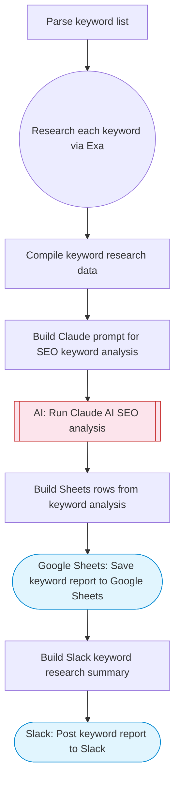

# SEO Keyword Research & Volume Analyzer

Takes a list of SEO keywords, researches search volume and competition data via Exa, uses Claude AI to analyze keyword difficulty and prioritize opportunities, and saves a comprehensive keyword research report to Google Sheets with a summary to Slack. Adapted from n8n's Google Keyword Planner search volume workflow.

> **Works with any AI agent.** Paste this page's URL into Claude Code, Codex, Cursor, Windsurf, OpenClaw, or any coding agent — it will read the docs, connect your platforms, and run this flow for you.

## Quick Start

```bash
# 1. Connect your platforms (one-time setup)
one add exa
one add google-sheets
one add slack

# 2. Run the flow
one flow execute n8n-2494-seo-keyword-volume \
  --input keywords="..." \
  --input spreadsheetId="..." \
  --input slackChannel="C01ABC123" \
  --input targetWebsite="..." \
  --input market="..."
```

## Platforms

| Platform | Used for |
|----------|----------|
| Exa | Keyword research |
| Google Sheets | Saving the report |
| Slack | Posting summary |

> Don't have these connected yet? Run `one list` to check, then `one add <platform>` to connect.

## What it does

1. Parse keyword list
2. Research each keyword via Exa
3. Compile keyword research data
4. Build Claude prompt for SEO keyword analysis
5. Run Claude AI SEO analysis
6. Save keyword report to Google Sheets
7. Build Slack keyword research summary
8. Post keyword report to Slack

## Flow diagram



## Inputs

| Input | Required | Description |
|-------|----------|-------------|
| `keywords` | Yes | Comma-separated list of SEO keywords to research (e.g. 'ai chatbot, workflow automation, no-code tools') |
| `spreadsheetId` | Yes | Google Sheets spreadsheet ID for the keyword report |
| `slackChannel` | Yes | Slack channel for the summary |
| `targetWebsite` | No | Target website URL for competition analysis (e.g. 'example.com') (default: ) |
| `market` | No | Target market/region (e.g. US, UK, Global) (default: US) |

---

<sub>Based on [n8n #2494](https://n8n.io/workflows/2494) · 20.1K views on n8n · by [simonscrapes](https://n8n.io/creators/simonscrapes) · Converted to One CLI on 2026-03-25</sub>
