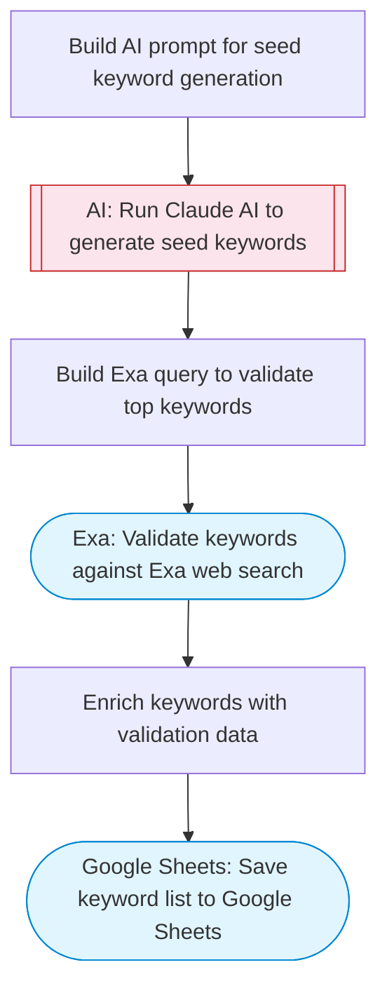

# SEO seed keyword generator with AI and Google Sheets

Uses Claude AI to generate SEO seed keywords based on an ideal customer profile and business niche, validates them against Exa web search, and saves the ranked keyword list to Google Sheets.

> **Works with any AI agent.** Paste this page's URL into Claude Code, Codex, Cursor, Windsurf, OpenClaw, or any coding agent — it will read the docs, connect your platforms, and run this flow for you.

## Quick Start

```bash
# 1. Connect your platforms (one-time setup)
one add exa
one add google-sheets

# 2. Run the flow
one flow execute n8n-2473-seo-seed-keywords-ai \
  --input businessNiche="..." \
  --input idealCustomer="..." \
  --input competitors="..."
```

## Platforms

| Platform | Used for |
|----------|----------|
| Exa | Validating keyword search volume |
| Google Sheets | Saving keyword list |

> Don't have these connected yet? Run `one list` to check, then `one add <platform>` to connect.

## What it does

1. Build AI prompt for seed keyword generation
2. Run Claude AI to generate seed keywords
3. Build Exa query to validate top keywords
4. Validate keywords against Exa web search
5. Enrich keywords with validation data
6. Save keyword list to Google Sheets

## Flow diagram



## Inputs

| Input | Required | Description |
|-------|----------|-------------|
| `businessNiche` | Yes | Your business niche or industry (e.g. 'B2B SaaS project management') |
| `idealCustomer` | Yes | Ideal customer profile (e.g. 'CTOs at mid-size tech companies looking for team productivity tools') |
| `competitors` | No | Comma-separated competitor names or URLs (optional) (default: ) |

---

<sub>Based on [n8n #2473](https://n8n.io/workflows/2473) · 24.8K views on n8n · by [simonscrapes](https://n8n.io/creators/simonscrapes) · Converted to One CLI on 2026-03-25</sub>
