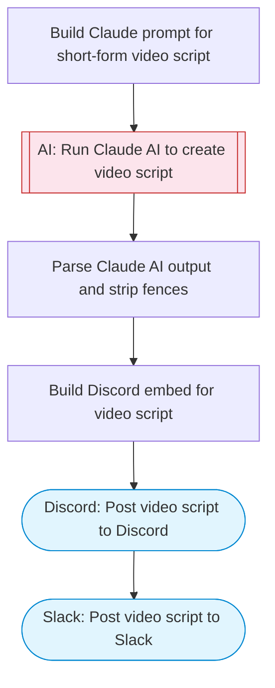

# AI Short-Form Video Script Generator

Claude AI creates professional short-form video scripts with AI image prompts, scene breakdowns, and voiceover text, then posts the scripts to both Discord and Slack for team review and production.

> **Works with any AI agent.** Paste this page's URL into Claude Code, Codex, Cursor, Windsurf, OpenClaw, or any coding agent — it will read the docs, connect your platforms, and run this flow for you.

## Quick Start

```bash
# 1. Connect your platforms (one-time setup)
one add slack
one add discord

# 2. Run the flow
one flow execute n8n-3121-short-form-video-generator \
  --input slackChannel="C01ABC123" \
  --input discordChannelId="C01ABC123" \
  --input topic="your topic here" \
  --input style="..." \
  --input duration="..."
```

## Platforms

| Platform | Used for |
|----------|----------|
| Slack | Posting video scripts |
| Discord | Posting video scripts |

> Don't have these connected yet? Run `one list` to check, then `one add <platform>` to connect.

## What it does

1. Build Claude prompt for short-form video script
2. Run Claude AI to create video script
3. Parse Claude AI output and strip fences
4. Build Discord embed for video script
5. Post video script to Discord
6. Post video script to Slack

## Flow diagram



## Inputs

| Input | Required | Description |
|-------|----------|-------------|
| `slackChannel` | Yes | Slack channel to post video scripts (e.g. '#video-scripts') |
| `discordChannelId` | Yes | Discord channel ID to post video scripts |
| `topic` | Yes | Topic or theme for the short-form video (e.g. 'productivity tips', 'cooking hacks') |
| `style` | No | Video style (default: 'POV storytelling'). Options: 'POV storytelling', 'tutorial', 'listicle', 'before-after', 'day-in-the-life' (default: POV storytelling) |
| `duration` | No | Target video duration (default: '30-60 seconds') (default: 30-60 seconds) |

---

<sub>Based on [n8n #3121](https://n8n.io/workflows/3121) · 113.2K views on n8n · by [camerondwills](https://n8n.io/creators/camerondwills) · Converted to One CLI on 2026-03-25</sub>
