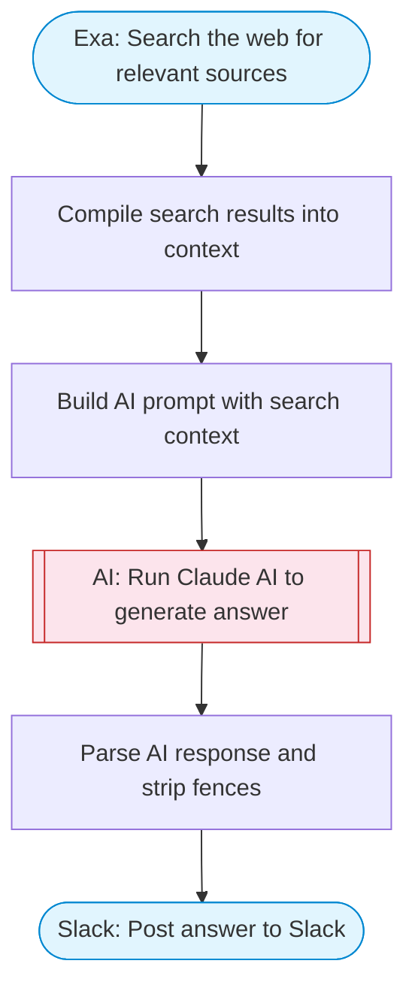

# Slack Chatbot — Exa Search + Claude AI Answers

Takes a question via input, searches the web with Exa for relevant sources, uses Claude AI to synthesize a comprehensive answer, and posts it to Slack with Block Kit formatting.

> **Works with any AI agent.** Paste this page's URL into Claude Code, Codex, Cursor, Windsurf, OpenClaw, or any coding agent — it will read the docs, connect your platforms, and run this flow for you.

## Quick Start

```bash
# 1. Connect your platforms (one-time setup)
one add exa
one add slack

# 2. Run the flow
one flow execute n8n-1961-slack-chatbot \
  --input slackChannel="C01ABC123" \
  --input question="your question here"
```

## Platforms

| Platform | Used for |
|----------|----------|
| Exa | Search the web for relevant sources |
| Slack | Post answer to Slack |

> Don't have these connected yet? Run `one list` to check, then `one add <platform>` to connect.

## What it does

1. Search the web for relevant sources
2. Compile search results into context
3. Build AI prompt with search context
4. Run Claude AI to generate answer
5. Parse AI response and strip fences
6. Post answer to Slack

## Flow diagram



## Inputs

| Input | Required | Description |
|-------|----------|-------------|
| `slackChannel` | Yes | Slack channel ID to post the answer |
| `question` | Yes | The question to answer (e.g. 'What is retrieval-augmented generation?') |

---

<sub>Based on [n8n #1961](https://n8n.io/workflows/1961) · 44.3K views on n8n · by [n8n-team](https://n8n.io/creators/n8n-team) · Converted to One CLI on 2026-03-25</sub>
