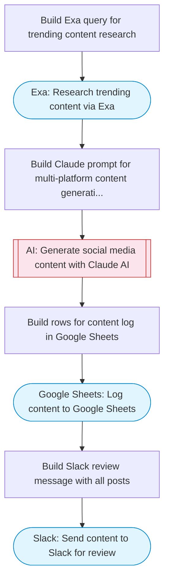

# AI Social Media Content Generator and Publisher

Takes a topic and target platforms, researches trending content via Exa, generates platform-optimized posts using Claude AI for multiple social networks, logs all content to Google Sheets, and sends drafts to Slack for review.

> **Works with any AI agent.** Paste this page's URL into Claude Code, Codex, Cursor, Windsurf, OpenClaw, or any coding agent — it will read the docs, connect your platforms, and run this flow for you.

## Quick Start

```bash
# 1. Connect your platforms (one-time setup)
one add exa
one add google-sheets
one add slack

# 2. Run the flow
one flow execute n8n-3082-social-content-generator \
  --input topic="your topic here" \
  --input platforms="..." \
  --input tone="..." \
  --input spreadsheetId="..." \
  --input sheetName="..." \
  --input slackChannel="C01ABC123"
```

## Platforms

| Platform | Used for |
|----------|----------|
| Exa | Content research |
| Google Sheets | Content log |
| Slack | Content review |

> Don't have these connected yet? Run `one list` to check, then `one add <platform>` to connect.

## What it does

1. Build Exa query for trending content research
2. Research trending content via Exa
3. Build Claude prompt for multi-platform content generation
4. Generate social media content with Claude AI
5. Build rows for content log in Google Sheets
6. Log content to Google Sheets
7. Build Slack review message with all posts
8. Send content to Slack for review

## Flow diagram



## Inputs

| Input | Required | Description |
|-------|----------|-------------|
| `topic` | Yes | Topic or subject to generate social media posts about |
| `platforms` | No | Comma-separated list of target platforms (default: Twitter, LinkedIn, Instagram) |
| `tone` | No | Content tone (professional, casual, witty, educational) (default: professional yet engaging) |
| `spreadsheetId` | Yes | Google Sheets spreadsheet ID for content log |
| `sheetName` | No | Sheet tab name (default: Social Posts) |
| `slackChannel` | Yes | Slack channel for content review |

---

<sub>Based on [n8n #3082](https://n8n.io/workflows/3082) · 22.5K views on n8n · by [gocmen](https://n8n.io/creators/gocmen) · Converted to One CLI on 2026-03-25</sub>
