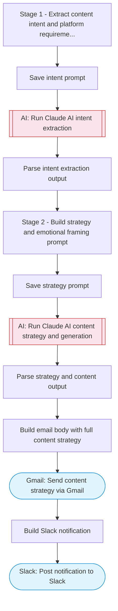

# AI-powered social media content generator with strategic multi-stage pipeline

Takes a content request, runs a multi-stage AI pipeline (intent extraction, strategy planning, emotional framing, content outline, and final generation) to produce polished social media posts, then delivers via Gmail and notifies Slack.

> **Works with any AI agent.** Paste this page's URL into Claude Code, Codex, Cursor, Windsurf, OpenClaw, or any coding agent — it will read the docs, connect your platforms, and run this flow for you.

## Quick Start

```bash
# 1. Connect your platforms (one-time setup)
one add gmail
one add slack

# 2. Run the flow
one flow execute n8n-6550-social-media-content \
  --input contentRequest="..." \
  --input recipientEmail="user@example.com" \
  --input slackChannel="C01ABC123"
```

## Platforms

| Platform | Used for |
|----------|----------|
| Gmail | Delivering content |
| Slack | Notifications |

> Don't have these connected yet? Run `one list` to check, then `one add <platform>` to connect.

## What it does

1. Stage 1 - Extract content intent and platform requirements
2. Save intent prompt
3. Run Claude AI intent extraction
4. Parse intent extraction output
5. Stage 2 - Build strategy and emotional framing prompt
6. Save strategy prompt
7. Run Claude AI content strategy and generation
8. Parse strategy and content output
9. Build email body with full content strategy
10. Send content strategy via Gmail
11. Post notification to Slack

## Flow diagram



## Inputs

| Input | Required | Description |
|-------|----------|-------------|
| `contentRequest` | Yes | Content creation request (e.g. 'Write a Twitter thread about remote work productivity tips targeting tech professionals') |
| `recipientEmail` | Yes | Email to send the generated content |
| `slackChannel` | Yes | Slack channel for content notifications |

---

<sub>Based on [n8n #6550](https://n8n.io/workflows/6550) · 28.0K views on n8n · by [idsinghbhambra](https://n8n.io/creators/idsinghbhambra) · Converted to One CLI on 2026-03-25</sub>
