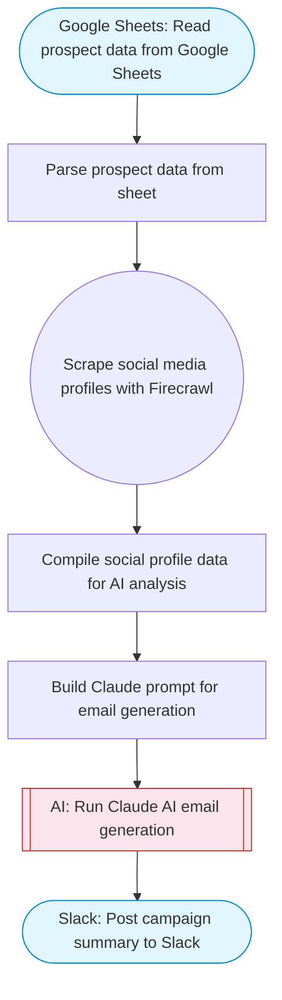

# Social media analysis and automated email generation

Reads prospect data from Google Sheets, scrapes their social media profiles with Firecrawl, uses Claude AI to analyze online presence and generate personalized outreach emails, and sends them via Gmail. Adapted from n8n's social media analysis and email generation workflow.

> **Works with any AI agent.** Paste this page's URL into Claude Code, Codex, Cursor, Windsurf, OpenClaw, or any coding agent — it will read the docs, connect your platforms, and run this flow for you.

## Quick Start

```bash
# 1. Connect your platforms (one-time setup)
one add google-sheets
one add firecrawl
one add gmail
one add slack

# 2. Run the flow
one flow execute n8n-2823-social-media-email-gen \
  --input slackChannel="C01ABC123" \
  --input spreadsheetId="..." \
  --input sheetRange="..." \
  --input senderName="Alex" \
  --input companyName="..." \
  --input valueProposition="..."
```

## Platforms

| Platform | Used for |
|----------|----------|
| Google Sheets | Prospect data |
| Firecrawl | Scraping social profiles |
| Gmail | Sending outreach emails |
| Slack | Status updates |

> Don't have these connected yet? Run `one list` to check, then `one add <platform>` to connect.

## What it does

1. Read prospect data from Google Sheets
2. Parse prospect data from sheet
3. Scrape social media profiles with Firecrawl
4. Compile social profile data for AI analysis
5. Build Claude prompt for email generation
6. Run Claude AI email generation
7. Post campaign summary to Slack

## Flow diagram



## Inputs

| Input | Required | Description |
|-------|----------|-------------|
| `slackChannel` | Yes | Slack channel ID for campaign updates |
| `spreadsheetId` | Yes | Google Sheets spreadsheet ID with prospect data |
| `sheetRange` | No | Sheet range with columns: Name, Email, Social URL, Company (default: Prospects!A1:D50) |
| `senderName` | No | Name to use in the email signature (default: Sales Team) |
| `companyName` | Yes | Your company name for personalized emails |
| `valueProposition` | Yes | Your product/service value proposition for email content |

---

<sub>Based on [n8n #2823](https://n8n.io/workflows/2823) · 30.1K views on n8n · by [Pollup](https://n8n.io/creators/Pollup) · Converted to One CLI on 2026-03-25</sub>
