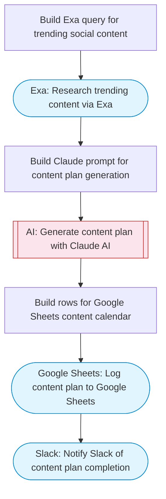

# AI Social Video Content Planner with Captions and Logging

Generates a social media video content plan with Claude AI, creates optimized captions and hashtags, logs content to Google Sheets for tracking, and notifies via Slack. Designed for Instagram Reels, TikTok, and YouTube Shorts.

> **Works with any AI agent.** Paste this page's URL into Claude Code, Codex, Cursor, Windsurf, OpenClaw, or any coding agent — it will read the docs, connect your platforms, and run this flow for you.

## Quick Start

```bash
# 1. Connect your platforms (one-time setup)
one add google-sheets
one add exa
one add slack

# 2. Run the flow
one flow execute n8n-5910-social-video-content-planner \
  --input contentTopic="your topic here" \
  --input numberOfPosts="..." \
  --input spreadsheetId="..." \
  --input sheetName="..." \
  --input slackChannel="C01ABC123"
```

## Platforms

| Platform | Used for |
|----------|----------|
| Google Sheets | Connection key |
| Exa | Trend research |
| Slack | Notify Slack of content plan completion |

> Don't have these connected yet? Run `one list` to check, then `one add <platform>` to connect.

## What it does

1. Build Exa query for trending social content
2. Research trending content via Exa
3. Build Claude prompt for content plan generation
4. Generate content plan with Claude AI
5. Build rows for Google Sheets content calendar
6. Log content plan to Google Sheets
7. Notify Slack of content plan completion

## Flow diagram



## Inputs

| Input | Required | Description |
|-------|----------|-------------|
| `contentTopic` | Yes | Topic or niche for social video content (e.g. 'AI productivity tips', 'cooking hacks') |
| `numberOfPosts` | No | Number of content ideas to generate (default: 5) |
| `spreadsheetId` | Yes | Google Sheets spreadsheet ID for content calendar |
| `sheetName` | No | Sheet tab name (default: Content Calendar) |
| `slackChannel` | Yes | Slack channel for notifications |

---

<sub>Based on [n8n #5910](https://n8n.io/workflows/5910) · 22.2K views on n8n · by [marconi](https://n8n.io/creators/marconi) · Converted to One CLI on 2026-03-25</sub>
