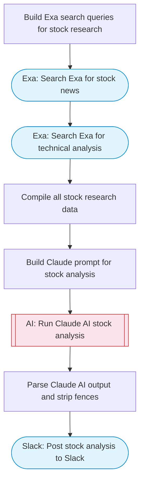

# AI Stock Analysis Report Generator

Uses Exa to search for recent stock news and technical analysis data, Claude AI generates a comprehensive report with sentiment analysis, technical indicators, bull/bear cases, and trading signals, then posts the report to Slack with Block Kit formatting.

> **Works with any AI agent.** Paste this page's URL into Claude Code, Codex, Cursor, Windsurf, OpenClaw, or any coding agent — it will read the docs, connect your platforms, and run this flow for you.

## Quick Start

```bash
# 1. Connect your platforms (one-time setup)
one add exa
one add slack

# 2. Run the flow
one flow execute n8n-3790-stock-analysis-reports \
  --input slackChannel="C01ABC123" \
  --input stockSymbol="..." \
  --input companyName="..."
```

## Platforms

| Platform | Used for |
|----------|----------|
| Exa | Searching stock news |
| Slack | Posting the report |

> Don't have these connected yet? Run `one list` to check, then `one add <platform>` to connect.

## What it does

1. Build Exa search queries for stock research
2. Search Exa for stock news
3. Search Exa for technical analysis
4. Compile all stock research data
5. Build Claude prompt for stock analysis
6. Run Claude AI stock analysis
7. Parse Claude AI output and strip fences
8. Post stock analysis to Slack

## Flow diagram



## Inputs

| Input | Required | Description |
|-------|----------|-------------|
| `slackChannel` | Yes | Slack channel to post the stock analysis report |
| `stockSymbol` | Yes | Stock ticker symbol to analyze (e.g. 'AAPL', 'TSLA', 'MSFT') |
| `companyName` | No | Full company name (auto-detected if not provided) |

---

<sub>Based on [n8n #3790](https://n8n.io/workflows/3790) · 79.1K views on n8n · by [elay96](https://n8n.io/creators/elay96) · Converted to One CLI on 2026-03-25</sub>
