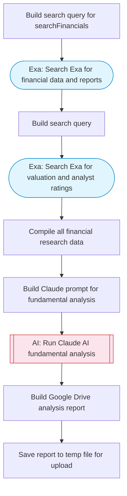

# AI stock fundamental analysis

Researches stock financials using Exa web search, Claude AI analyzes fundamentals including revenue, earnings, margins, and valuation metrics, then saves a structured analysis report to Google Drive. Adapted from n8n's AI crew fundamental stock analysis workflow.

> **Works with any AI agent.** Paste this page's URL into Claude Code, Codex, Cursor, Windsurf, OpenClaw, or any coding agent — it will read the docs, connect your platforms, and run this flow for you.

## Quick Start

```bash
# 1. Connect your platforms (one-time setup)
one add exa
one add google-drive

# 2. Run the flow
one flow execute n8n-191-stock-fundamental-analysis \
  --input ticker="..." \
  --input companyName="..." \
  --input driveFolderId="..."
```

## Platforms

| Platform | Used for |
|----------|----------|
| Exa | Financial research |
| Google Drive | Saving the analysis report |

> Don't have these connected yet? Run `one list` to check, then `one add <platform>` to connect.

## What it does

1. Build search query for searchFinancials
2. Search Exa for financial data and reports
3. Build search query
4. Search Exa for valuation and analyst ratings
5. Compile all financial research data
6. Build Claude prompt for fundamental analysis
7. Run Claude AI fundamental analysis
8. Build Google Drive analysis report
9. Save report to temp file for upload

## Flow diagram



## Inputs

| Input | Required | Description |
|-------|----------|-------------|
| `ticker` | Yes | Stock ticker symbol to analyze (e.g., AAPL, MSFT, TSLA) |
| `companyName` | Yes | Full company name for the stock (e.g., Apple Inc.) |
| `driveFolderId` | No | Google Drive folder ID for saving the report (default: root) |

---

<sub>Based on [n8n #191](https://n8n.io/workflows/191) · 31.9K views on n8n · Converted to One CLI on 2026-03-25</sub>
