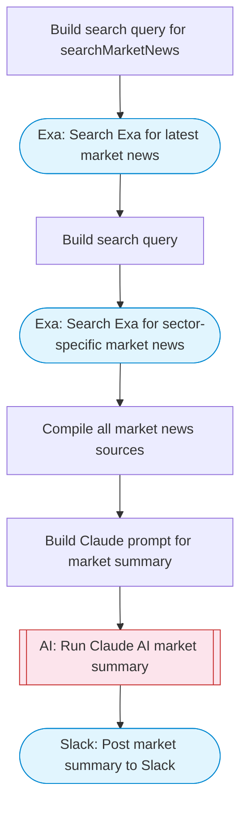

# AI-powered stock market summary bot

Searches for the latest market news via Exa, Claude AI summarizes market movements, key events, and sector performance, then posts a formatted daily market summary to Slack with Block Kit formatting. Adapted from n8n's AI-powered stock market summary bot workflow.

> **Works with any AI agent.** Paste this page's URL into Claude Code, Codex, Cursor, Windsurf, OpenClaw, or any coding agent — it will read the docs, connect your platforms, and run this flow for you.

## Quick Start

```bash
# 1. Connect your platforms (one-time setup)
one add exa
one add slack

# 2. Run the flow
one flow execute n8n-200-stock-market-summary \
  --input slackChannel="C01ABC123" \
  --input marketFocus="..." \
  --input sectors="..."
```

## Platforms

| Platform | Used for |
|----------|----------|
| Exa | Market news search |
| Slack | Posting the market summary |

> Don't have these connected yet? Run `one list` to check, then `one add <platform>` to connect.

## What it does

1. Build search query for searchMarketNews
2. Search Exa for latest market news
3. Build search query
4. Search Exa for sector-specific market news
5. Compile all market news sources
6. Build Claude prompt for market summary
7. Run Claude AI market summary
8. Post market summary to Slack

## Flow diagram



## Inputs

| Input | Required | Description |
|-------|----------|-------------|
| `slackChannel` | Yes | Slack channel ID to post the market summary |
| `marketFocus` | No | Market focus area (e.g., 'US stock market', 'crypto', 'global markets') (default: US stock market) |
| `sectors` | No | Comma-separated list of sectors to track (default: technology, healthcare, finance, energy, consumer) |

---

<sub>Based on [n8n #200](https://n8n.io/workflows/200) · 30.8K views on n8n · Converted to One CLI on 2026-03-25</sub>
