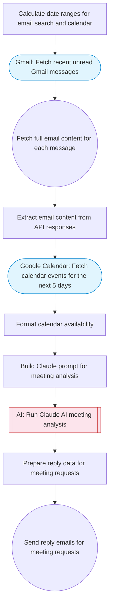

# Suggest meeting slots using AI

Fetches recent Gmail messages to find meeting requests, checks Google Calendar availability for the next few days, uses Claude AI to identify meeting requests and suggest available time slots, then sends a reply via Gmail with proposed meeting times.

> **Works with any AI agent.** Paste this page's URL into Claude Code, Codex, Cursor, Windsurf, OpenClaw, or any coding agent — it will read the docs, connect your platforms, and run this flow for you.

## Quick Start

```bash
# 1. Connect your platforms (one-time setup)
one add gmail
one add google-calendar

# 2. Run the flow
one flow execute n8n-1953-suggest-meeting-slots \
  --input lookbackHours="..." \
  --input workingHoursStart="..." \
  --input workingHoursEnd="..." \
  --input meetingDuration="..." \
  --input senderName="Alex"
```

## Platforms

| Platform | Used for |
|----------|----------|
| Gmail | Fetch recent unread Gmail messages |
| Google Calendar | Connection key |

> Don't have these connected yet? Run `one list` to check, then `one add <platform>` to connect.

## What it does

1. Calculate date ranges for email search and calendar
2. Fetch recent unread Gmail messages
3. Fetch full email content for each message
4. Extract email content from API responses
5. Fetch calendar events for the next 5 days
6. Format calendar availability
7. Build Claude prompt for meeting analysis
8. Run Claude AI meeting analysis
9. Prepare reply data for meeting requests
10. Send reply emails for meeting requests

## Flow diagram



## Inputs

| Input | Required | Description |
|-------|----------|-------------|
| `lookbackHours` | No | How many hours back to scan for meeting requests (default: 24) |
| `workingHoursStart` | No | Start of working hours (24h format, e.g. 9) (default: 9) |
| `workingHoursEnd` | No | End of working hours (24h format, e.g. 17) (default: 17) |
| `meetingDuration` | No | Default meeting duration in minutes (default: 30) |
| `senderName` | No | Name to sign the reply email with (default: AI Assistant) |

---

<sub>Based on [n8n #1953](https://n8n.io/workflows/1953) · 101.6K views on n8n · by [n8n-team](https://n8n.io/creators/n8n-team) · Converted to One CLI on 2026-03-24</sub>
