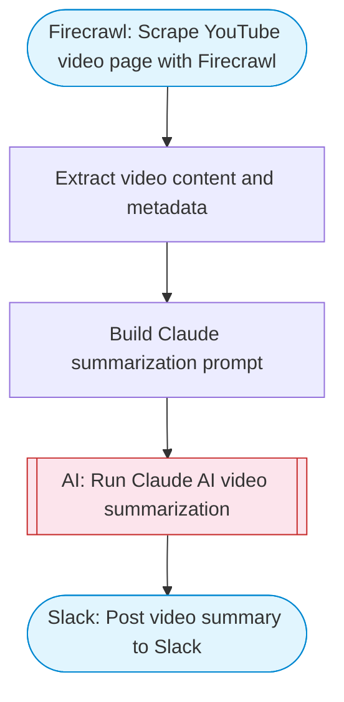

# YouTube video summarizer

Takes a YouTube URL, scrapes the page content with Firecrawl to extract transcript and metadata, uses Claude AI to generate a comprehensive summary with key takeaways, and posts the summary to Slack.

> **Works with any AI agent.** Paste this page's URL into Claude Code, Codex, Cursor, Windsurf, OpenClaw, or any coding agent — it will read the docs, connect your platforms, and run this flow for you.

## Quick Start

```bash
# 1. Connect your platforms (one-time setup)
one add firecrawl
one add slack

# 2. Run the flow
one flow execute n8n-3917-summarize-youtube \
  --input slackChannel="C01ABC123" \
  --input youtubeUrl="https://example.com" \
  --input summaryStyle="..."
```

## Platforms

| Platform | Used for |
|----------|----------|
| Firecrawl | Web scraping |
| Slack | Post video summary to Slack |

> Don't have these connected yet? Run `one list` to check, then `one add <platform>` to connect.

## What it does

1. Scrape YouTube video page with Firecrawl
2. Extract video content and metadata
3. Build Claude summarization prompt
4. Run Claude AI video summarization
5. Post video summary to Slack

## Flow diagram



## Inputs

| Input | Required | Description |
|-------|----------|-------------|
| `slackChannel` | Yes | Slack channel to post the summary |
| `youtubeUrl` | Yes | YouTube video URL to summarize (e.g. 'https://www.youtube.com/watch?v=...') |
| `summaryStyle` | No | Summary style: 'brief' (key points only), 'detailed' (full summary), 'executive' (business-focused) (default: detailed) |

---

<sub>Based on [n8n #3917](https://n8n.io/workflows/2736) · 83.8K views on n8n · Converted to One CLI on 2026-03-25</sub>
