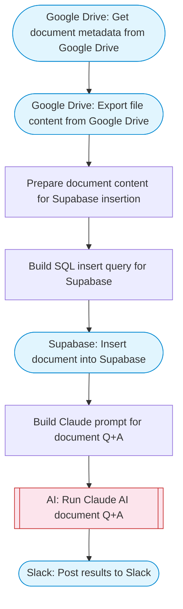

# Supabase document insertion, storage, and AI retrieval

Fetches a document from Google Drive, stores its content in Supabase via SQL, and uses Claude AI to answer questions about the stored documents. Adapted from n8n's Supabase insertion/upsertion/retrieval workflow.

> **Works with any AI agent.** Paste this page's URL into Claude Code, Codex, Cursor, Windsurf, OpenClaw, or any coding agent — it will read the docs, connect your platforms, and run this flow for you.

## Quick Start

```bash
# 1. Connect your platforms (one-time setup)
one add google-drive
one add supabase
one add slack

# 2. Run the flow
one flow execute n8n-2395-supabase-crud-rag \
  --input slackChannel="C01ABC123" \
  --input driveFileId="..." \
  --input supabaseProjectRef="..." \
  --input tableName="..." \
  --input question="your question here"
```

## Platforms

| Platform | Used for |
|----------|----------|
| Google Drive | Fetching documents |
| Supabase | Database operations |
| Slack | Status notifications |

> Don't have these connected yet? Run `one list` to check, then `one add <platform>` to connect.

## What it does

1. Get document metadata from Google Drive
2. Export file content from Google Drive
3. Prepare document content for Supabase insertion
4. Build SQL insert query for Supabase
5. Insert document into Supabase
6. Build Claude prompt for document Q&A
7. Run Claude AI document Q&A
8. Post results to Slack

## Flow diagram



## Inputs

| Input | Required | Description |
|-------|----------|-------------|
| `slackChannel` | Yes | Slack channel ID for operation results |
| `driveFileId` | Yes | Google Drive file ID of the document to ingest |
| `supabaseProjectRef` | Yes | Supabase project reference ID |
| `tableName` | No | Supabase table name for document storage (default: documents) |
| `question` | No | Optional question to ask about the stored documents (default: ) |

---

<sub>Based on [n8n #2395](https://n8n.io/workflows/2395) · 29.2K views on n8n · by [riascho](https://n8n.io/creators/riascho) · Converted to One CLI on 2026-03-25</sub>
