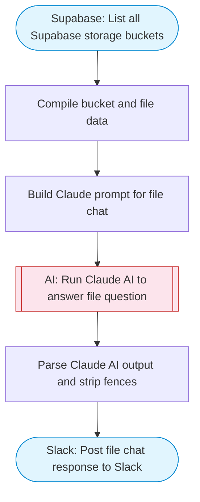

# AI Supabase File Chat Agent

Lists storage buckets and files from Supabase, lets users ask questions about their stored data, Claude AI analyzes the file inventory and answers questions, then posts the response to Slack with Block Kit formatting.

> **Works with any AI agent.** Paste this page's URL into Claude Code, Codex, Cursor, Windsurf, OpenClaw, or any coding agent — it will read the docs, connect your platforms, and run this flow for you.

## Quick Start

```bash
# 1. Connect your platforms (one-time setup)
one add supabase
one add slack

# 2. Run the flow
one flow execute n8n-2621-supabase-file-chat \
  --input slackChannel="C01ABC123" \
  --input projectRef="..." \
  --input question="your question here"
```

## Platforms

| Platform | Used for |
|----------|----------|
| Supabase | Accessing storage |
| Slack | Posting responses |

> Don't have these connected yet? Run `one list` to check, then `one add <platform>` to connect.

## What it does

1. List all Supabase storage buckets
2. Compile bucket and file data
3. Build Claude prompt for file chat
4. Run Claude AI to answer file question
5. Parse Claude AI output and strip fences
6. Post file chat response to Slack

## Flow diagram



## Inputs

| Input | Required | Description |
|-------|----------|-------------|
| `slackChannel` | Yes | Slack channel to post the file analysis |
| `projectRef` | Yes | Supabase project reference ID (20-char string from project URL) |
| `question` | Yes | Question to ask about the Supabase storage files (e.g. 'What types of files are stored?', 'How is the storage organized?') |

---

<sub>Based on [n8n #2621](https://n8n.io/workflows/2621) · 80.1K views on n8n · by [lowcodingdev](https://n8n.io/creators/lowcodingdev) · Converted to One CLI on 2026-03-25</sub>
