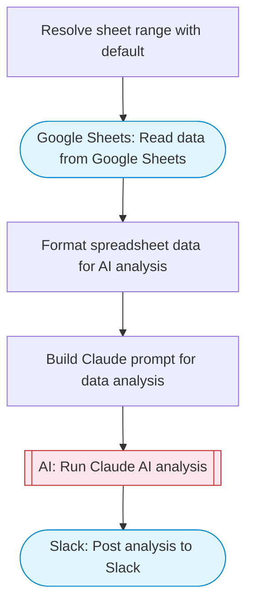

# Talk to your Google Sheets data using AI

Reads data from a Google Sheets spreadsheet, uses Claude AI to analyze and answer questions about the data, and posts the response to Slack using Block Kit formatting.

> **Works with any AI agent.** Paste this page's URL into Claude Code, Codex, Cursor, Windsurf, OpenClaw, or any coding agent — it will read the docs, connect your platforms, and run this flow for you.

## Quick Start

```bash
# 1. Connect your platforms (one-time setup)
one add google-sheets
one add slack

# 2. Run the flow
one flow execute n8n-7639-talk-google-sheets \
  --input spreadsheetId="..." \
  --input range="..." \
  --input question="your question here" \
  --input slackChannel="C01ABC123"
```

## Platforms

| Platform | Used for |
|----------|----------|
| Google Sheets | Connection key |
| Slack | Post analysis to Slack |

> Don't have these connected yet? Run `one list` to check, then `one add <platform>` to connect.

## What it does

1. Resolve sheet range with default
2. Read data from Google Sheets
3. Format spreadsheet data for AI analysis
4. Build Claude prompt for data analysis
5. Run Claude AI analysis
6. Post analysis to Slack

## Flow diagram



## Inputs

| Input | Required | Description |
|-------|----------|-------------|
| `spreadsheetId` | Yes | The ID of the Google Sheets spreadsheet to analyze |
| `range` | No | Sheet range to read (e.g. 'Sheet1' or 'Sheet1!A1:Z100') (default: Sheet1) |
| `question` | Yes | Question to ask about the spreadsheet data |
| `slackChannel` | Yes | Slack channel to post the answer |

---

<sub>Based on [n8n #7639](https://n8n.io/workflows/7639) · 114.5K views on n8n · by [rbreen](https://n8n.io/creators/rbreen) · Converted to One CLI on 2026-03-24</sub>
