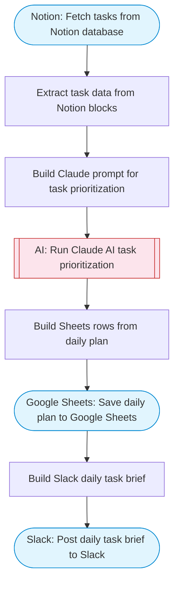

# AI Task Manager with Notion

Reads tasks from a Notion database, uses Claude AI to prioritize, organize, and suggest optimizations for the task list, updates the prioritized plan back to Google Sheets, and posts a daily task brief to Slack. Adapted from n8n's AI-powered Telegram task manager with MCP server.

> **Works with any AI agent.** Paste this page's URL into Claude Code, Codex, Cursor, Windsurf, OpenClaw, or any coding agent — it will read the docs, connect your platforms, and run this flow for you.

## Quick Start

```bash
# 1. Connect your platforms (one-time setup)
one add notion
one add google-sheets
one add slack

# 2. Run the flow
one flow execute n8n-3656-task-manager-notion \
  --input notionDatabaseId="..." \
  --input spreadsheetId="..." \
  --input slackChannel="C01ABC123" \
  --input focusAreas="..."
```

## Platforms

| Platform | Used for |
|----------|----------|
| Notion | Reading tasks |
| Google Sheets | Saving prioritized plan |
| Slack | The daily brief |

> Don't have these connected yet? Run `one list` to check, then `one add <platform>` to connect.

## What it does

1. Fetch tasks from Notion database
2. Extract task data from Notion blocks
3. Build Claude prompt for task prioritization
4. Run Claude AI task prioritization
5. Save daily plan to Google Sheets
6. Build Slack daily task brief
7. Post daily task brief to Slack

## Flow diagram



## Inputs

| Input | Required | Description |
|-------|----------|-------------|
| `notionDatabaseId` | Yes | Notion database ID containing tasks |
| `spreadsheetId` | Yes | Google Sheets spreadsheet ID for the task plan |
| `slackChannel` | Yes | Slack channel for the task brief |
| `focusAreas` | No | Comma-separated focus areas or goals for today (e.g. 'shipping feature X, client deliverable') (default: ) |

---

<sub>Based on [n8n #3656](https://n8n.io/workflows/3656) · 20.3K views on n8n · by [gatura](https://n8n.io/creators/gatura) · Converted to One CLI on 2026-03-25</sub>
