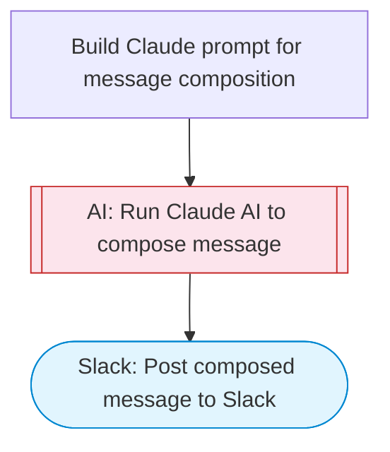

# Channel Message Composer & Sender

Composes a professional channel message using Claude AI based on a topic and context, then posts it to Slack with Block Kit formatting. Adapted from n8n's Microsoft Teams channel messaging workflow.

> **Works with any AI agent.** Paste this page's URL into Claude Code, Codex, Cursor, Windsurf, OpenClaw, or any coding agent — it will read the docs, connect your platforms, and run this flow for you.

## Quick Start

```bash
# 1. Connect your platforms (one-time setup)
one add slack

# 2. Run the flow
one flow execute n8n-680-teams-channel-messaging \
  --input slackChannel="C01ABC123" \
  --input topic="your topic here" \
  --input context="..." \
  --input messageType="..."
```

## Platforms

| Platform | Used for |
|----------|----------|
| Slack | Posting messages |

> Don't have these connected yet? Run `one list` to check, then `one add <platform>` to connect.

## What it does

1. Build Claude prompt for message composition
2. Run Claude AI to compose message
3. Post composed message to Slack

## Flow diagram



## Inputs

| Input | Required | Description |
|-------|----------|-------------|
| `slackChannel` | Yes | Slack channel ID to post the message |
| `topic` | Yes | Topic or subject for the channel message |
| `context` | No | Additional context, audience info, or tone instructions for the message (default: ) |
| `messageType` | No | Type of message: announcement, update, reminder, question, or discussion (default: announcement) |

---

<sub>Based on [n8n #680](https://n8n.io/workflows/680) · 21.7K views on n8n · by [sm-amudhan](https://n8n.io/creators/sm-amudhan) · Converted to One CLI on 2026-03-25</sub>
