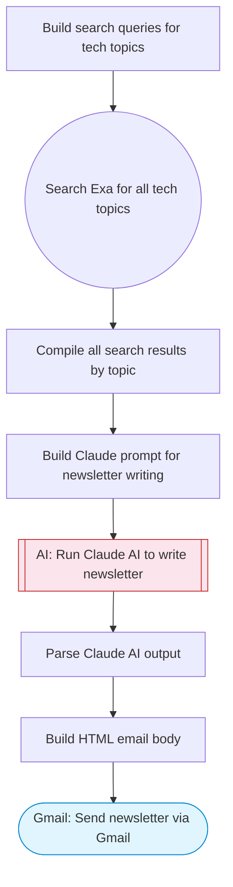

# AI Tech Newsletter via Gmail

Uses Exa to search for trending tech stories across multiple topics, Claude AI curates and writes a polished newsletter with summaries and analysis, then sends the formatted HTML newsletter via Gmail.

> **Works with any AI agent.** Paste this page's URL into Claude Code, Codex, Cursor, Windsurf, OpenClaw, or any coding agent — it will read the docs, connect your platforms, and run this flow for you.

## Quick Start

```bash
# 1. Connect your platforms (one-time setup)
one add exa
one add gmail

# 2. Run the flow
one flow execute n8n-3986-tech-newsletter-gmail \
  --input recipientEmail="user@example.com" \
  --input senderName="Alex" \
  --input topics="your topic here"
```

## Platforms

| Platform | Used for |
|----------|----------|
| Exa | Searching tech news |
| Gmail | Sending the newsletter |

> Don't have these connected yet? Run `one list` to check, then `one add <platform>` to connect.

## What it does

1. Build search queries for tech topics
2. Search Exa for all tech topics
3. Compile all search results by topic
4. Build Claude prompt for newsletter writing
5. Run Claude AI to write newsletter
6. Parse Claude AI output
7. Build HTML email body
8. Send newsletter via Gmail

## Flow diagram



## Inputs

| Input | Required | Description |
|-------|----------|-------------|
| `recipientEmail` | Yes | Email address to send the newsletter to |
| `senderName` | No | Name shown as the newsletter sender (default: AI Tech Digest) |
| `topics` | No | Comma-separated tech topics of interest (default: AI, cloud computing, cybersecurity, startups, developer tools) |

---

<sub>Based on [n8n #3986](https://n8n.io/workflows/3986) · 68.9K views on n8n · by [miha](https://n8n.io/creators/miha) · Converted to One CLI on 2026-03-25</sub>
