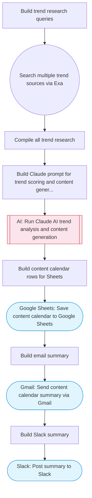

# Trend-Driven Social Content Generator

Extracts trending topics via Exa search, uses Claude AI to score trends and generate platform-specific social media content, saves the content calendar to Google Sheets, and emails a summary via Gmail. Adapted from n8n's Reddit/Google Trends social content workflow.

> **Works with any AI agent.** Paste this page's URL into Claude Code, Codex, Cursor, Windsurf, OpenClaw, or any coding agent — it will read the docs, connect your platforms, and run this flow for you.

## Quick Start

```bash
# 1. Connect your platforms (one-time setup)
one add exa
one add google-sheets
one add gmail
one add slack

# 2. Run the flow
one flow execute n8n-3560-trend-social-content \
  --input spreadsheetId="..." \
  --input slackChannel="C01ABC123" \
  --input industry="B2B SaaS" \
  --input emailRecipient="user@example.com" \
  --input platforms="..."
```

## Platforms

| Platform | Used for |
|----------|----------|
| Exa | Trend research |
| Google Sheets | Saving content calendar |
| Gmail | Sending summary email |
| Slack | Posting summary |

> Don't have these connected yet? Run `one list` to check, then `one add <platform>` to connect.

## What it does

1. Build trend research queries
2. Search multiple trend sources via Exa
3. Compile all trend research
4. Build Claude prompt for trend scoring and content generation
5. Run Claude AI trend analysis and content generation
6. Build content calendar rows for Sheets
7. Save content calendar to Google Sheets
8. Build email summary
9. Send content calendar summary via Gmail
10. Post summary to Slack

## Flow diagram



## Inputs

| Input | Required | Description |
|-------|----------|-------------|
| `spreadsheetId` | Yes | Google Sheets spreadsheet ID for content calendar |
| `slackChannel` | Yes | Slack channel for summary |
| `industry` | Yes | Industry or niche for trend research (e.g. 'SaaS marketing', 'health tech') |
| `emailRecipient` | Yes | Email address to send the content calendar summary |
| `platforms` | No | Comma-separated social media platforms to create content for (default: LinkedIn, Twitter, Instagram) |

---

<sub>Based on [n8n #3560](https://n8n.io/workflows/3560) · 20.5K views on n8n · by [spectrabit](https://n8n.io/creators/spectrabit) · Converted to One CLI on 2026-03-25</sub>
