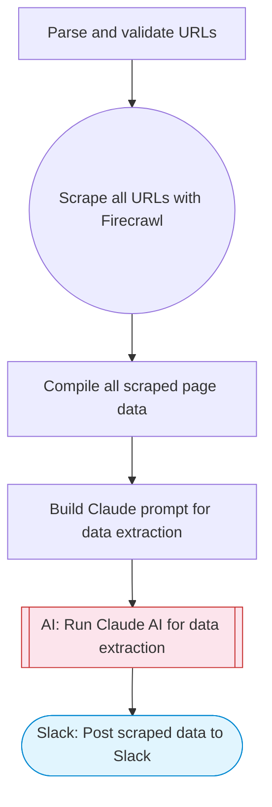

# Ultimate scraper: multi-URL scrape with AI extraction

Scrapes multiple URLs using Firecrawl, uses Claude AI to extract and structure data from each page, compiles all results, and posts a comprehensive summary to Slack with Block Kit formatting.

> **Works with any AI agent.** Paste this page's URL into Claude Code, Codex, Cursor, Windsurf, OpenClaw, or any coding agent — it will read the docs, connect your platforms, and run this flow for you.

## Quick Start

```bash
# 1. Connect your platforms (one-time setup)
one add firecrawl
one add slack

# 2. Run the flow
one flow execute n8n-2431-ultimate-scraper \
  --input slackChannel="C01ABC123" \
  --input urls="https://example.com" \
  --input extractionGoal="..."
```

## Platforms

| Platform | Used for |
|----------|----------|
| Firecrawl | Web scraping |
| Slack | Posting results |

> Don't have these connected yet? Run `one list` to check, then `one add <platform>` to connect.

## What it does

1. Parse and validate URLs
2. Scrape all URLs with Firecrawl
3. Compile all scraped page data
4. Build Claude prompt for data extraction
5. Run Claude AI for data extraction
6. Post scraped data to Slack

## Flow diagram



## Inputs

| Input | Required | Description |
|-------|----------|-------------|
| `slackChannel` | Yes | Slack channel ID for posting scraped data |
| `urls` | Yes | Comma-separated list of URLs to scrape (e.g. 'https://example.com/page1, https://example.com/page2') |
| `extractionGoal` | Yes | What data to extract from the pages (e.g. 'product names, prices, and descriptions', 'company info and contact details') |

---

<sub>Based on [n8n #2431](https://n8n.io/workflows/2431) · 54.6K views on n8n · by [pablobarrier](https://n8n.io/creators/pablobarrier) · Converted to One CLI on 2026-03-25</sub>
