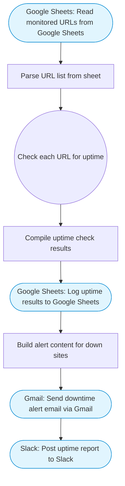

# Uptime monitoring with Slack and Gmail alerts

Reads a list of URLs from Google Sheets, checks each one via HTTP, logs results back to the sheet, and sends Slack alerts and Gmail notifications for any downtime. Adapted from n8n's uptime monitoring with scheduled triggers workflow.

> **Works with any AI agent.** Paste this page's URL into Claude Code, Codex, Cursor, Windsurf, OpenClaw, or any coding agent — it will read the docs, connect your platforms, and run this flow for you.

## Quick Start

```bash
# 1. Connect your platforms (one-time setup)
one add google-sheets
one add slack
one add gmail

# 2. Run the flow
one flow execute n8n-2327-uptime-monitor \
  --input slackChannel="C01ABC123" \
  --input spreadsheetId="..." \
  --input sheetRange="..." \
  --input alertEmail="user@example.com"
```

## Platforms

| Platform | Used for |
|----------|----------|
| Google Sheets | Url list and logging |
| Slack | Downtime alerts |
| Gmail | Email alerts |

> Don't have these connected yet? Run `one list` to check, then `one add <platform>` to connect.

## What it does

1. Read monitored URLs from Google Sheets
2. Parse URL list from sheet
3. Check each URL for uptime
4. Compile uptime check results
5. Log uptime results to Google Sheets
6. Build alert content for down sites
7. Send downtime alert email via Gmail
8. Post uptime report to Slack

## Flow diagram



## Inputs

| Input | Required | Description |
|-------|----------|-------------|
| `slackChannel` | Yes | Slack channel ID for uptime alerts |
| `spreadsheetId` | Yes | Google Sheets spreadsheet ID with URLs to monitor |
| `sheetRange` | No | Sheet range with columns: URL, Name (default: Monitors!A1:B20) |
| `alertEmail` | Yes | Email address for downtime alerts |

---

<sub>Based on [n8n #2327](https://n8n.io/workflows/2327) · 28.9K views on n8n · by [jimleuk](https://n8n.io/creators/jimleuk) · Converted to One CLI on 2026-03-25</sub>
