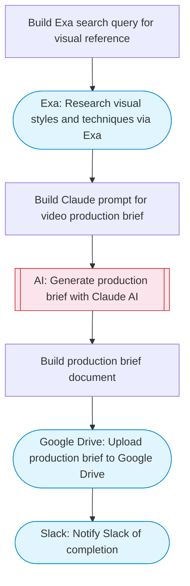

# Generate AI Video from Prompt and Upload to Google Drive

Takes a text prompt, uses Claude AI to generate an optimized video production brief, researches visual styles via Exa, and uploads a final project plan to Google Drive for production handoff.

> **Works with any AI agent.** Paste this page's URL into Claude Code, Codex, Cursor, Windsurf, OpenClaw, or any coding agent — it will read the docs, connect your platforms, and run this flow for you.

## Quick Start

```bash
# 1. Connect your platforms (one-time setup)
one add google-drive
one add exa
one add slack

# 2. Run the flow
one flow execute n8n-5228-veo3-video-drive-upload \
  --input videoPrompt="..." \
  --input slackChannel="C01ABC123" \
  --input driveFolderId="..."
```

## Platforms

| Platform | Used for |
|----------|----------|
| Google Drive | Connection key |
| Exa | Visual research |
| Slack | Status notification |

> Don't have these connected yet? Run `one list` to check, then `one add <platform>` to connect.

## What it does

1. Build Exa search query for visual reference
2. Research visual styles and techniques via Exa
3. Build Claude prompt for video production brief
4. Generate production brief with Claude AI
5. Build production brief document
6. Upload production brief to Google Drive
7. Notify Slack of completion

## Flow diagram



## Inputs

| Input | Required | Description |
|-------|----------|-------------|
| `videoPrompt` | Yes | Text prompt describing the video to generate (e.g. 'A cinematic drone shot of a coastal sunset with gentle waves') |
| `slackChannel` | Yes | Slack channel for completion notification |
| `driveFolderId` | No | Google Drive folder ID to upload the production brief to (default: root) |

---

<sub>Based on [n8n #5228](https://n8n.io/workflows/5228) · 23.4K views on n8n · by [jaruphatj](https://n8n.io/creators/jaruphatj) · Converted to One CLI on 2026-03-25</sub>
