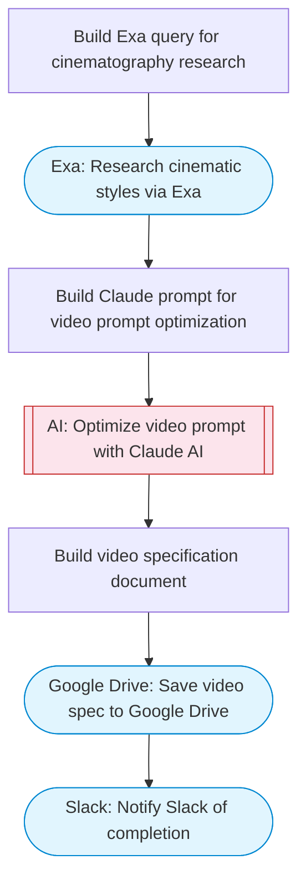

# AI Video Prompt Optimizer with Google Drive Storage

Takes a simple video idea, optimizes the prompt using Claude AI for cinematic quality, researches visual styles via Exa, generates a complete video specification document, and stores it in Google Drive with Slack notification.

> **Works with any AI agent.** Paste this page's URL into Claude Code, Codex, Cursor, Windsurf, OpenClaw, or any coding agent — it will read the docs, connect your platforms, and run this flow for you.

## Quick Start

```bash
# 1. Connect your platforms (one-time setup)
one add google-drive
one add exa
one add slack

# 2. Run the flow
one flow execute n8n-4767-veo3-video-optimizer-drive \
  --input videoIdea="..." \
  --input videoLength="..." \
  --input slackChannel="C01ABC123"
```

## Platforms

| Platform | Used for |
|----------|----------|
| Google Drive | Connection key |
| Exa | Visual style research |
| Slack | Notify Slack of completion |

> Don't have these connected yet? Run `one list` to check, then `one add <platform>` to connect.

## What it does

1. Build Exa query for cinematography research
2. Research cinematic styles via Exa
3. Build Claude prompt for video prompt optimization
4. Optimize video prompt with Claude AI
5. Build video specification document
6. Save video spec to Google Drive
7. Notify Slack of completion

## Flow diagram



## Inputs

| Input | Required | Description |
|-------|----------|-------------|
| `videoIdea` | Yes | Simple video idea or description to optimize |
| `videoLength` | No | Target video length in seconds (default: 8) |
| `slackChannel` | Yes | Slack channel for completion notification |

---

<sub>Based on [n8n #4767](https://n8n.io/workflows/4767) · 21.9K views on n8n · by [freddy-schuetz](https://n8n.io/creators/freddy-schuetz) · Converted to One CLI on 2026-03-25</sub>
