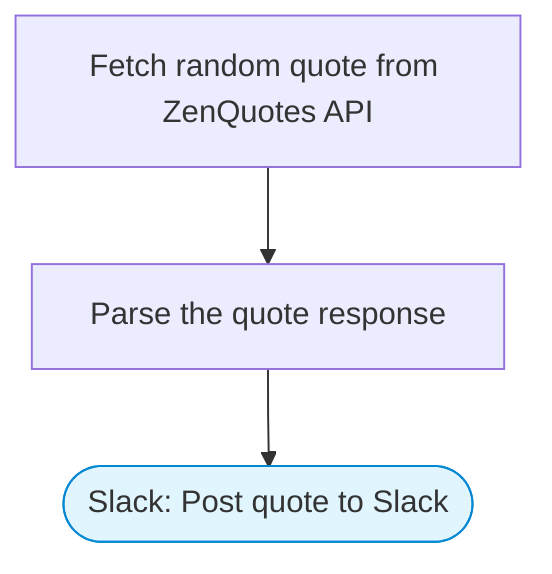

# Hello World — Random Quote to Slack

A simple hello-world flow: fetches a random inspirational quote from the ZenQuotes API and posts it to Slack with Block Kit formatting. Great starter workflow.

> **Works with any AI agent.** Paste this page's URL into Claude Code, Codex, Cursor, Windsurf, OpenClaw, or any coding agent — it will read the docs, connect your platforms, and run this flow for you.

## Quick Start

```bash
# 1. Connect your platforms (one-time setup)
one add slack

# 2. Run the flow
one flow execute n8n-1700-very-quick-quickstart \
  --input slackChannel="C01ABC123"
```

## Platforms

| Platform | Used for |
|----------|----------|
| Slack | Post quote to Slack |

> Don't have these connected yet? Run `one list` to check, then `one add <platform>` to connect.

## What it does

1. Fetch random quote from ZenQuotes API
2. Parse the quote response
3. Post quote to Slack

## Flow diagram



## Inputs

| Input | Required | Description |
|-------|----------|-------------|
| `slackChannel` | Yes | Slack channel ID to post the quote |

---

<sub>Based on [n8n #1700](https://n8n.io/workflows/1700) · 317.4K views on n8n · by [deborah](https://n8n.io/creators/deborah) · Converted to One CLI on 2026-03-24</sub>
