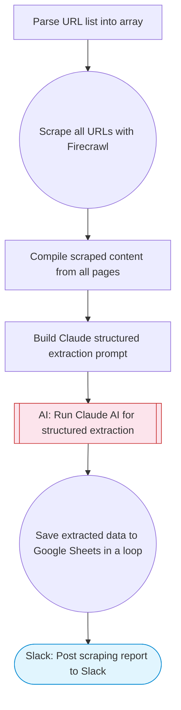

# Vision AI Scraper — Firecrawl + Claude Structured Extraction to Sheets

Scrapes web pages using Firecrawl, uses Claude AI to extract structured data from the content (products, prices, contacts, etc.), and saves the extracted data to Google Sheets.

> **Works with any AI agent.** Paste this page's URL into Claude Code, Codex, Cursor, Windsurf, OpenClaw, or any coding agent — it will read the docs, connect your platforms, and run this flow for you.

## Quick Start

```bash
# 1. Connect your platforms (one-time setup)
one add firecrawl
one add google-sheets
one add slack

# 2. Run the flow
one flow execute n8n-2563-vision-ai-scraper \
  --input slackChannel="C01ABC123" \
  --input urls="https://example.com" \
  --input spreadsheetUrl="https://example.com" \
  --input sheetName="..." \
  --input extractionSchema="..."
```

## Platforms

| Platform | Used for |
|----------|----------|
| Firecrawl | Web scraping |
| Google Sheets | Saving extracted data |
| Slack | Notifications |

> Don't have these connected yet? Run `one list` to check, then `one add <platform>` to connect.

## What it does

1. Parse URL list into array
2. Scrape all URLs with Firecrawl
3. Compile scraped content from all pages
4. Build Claude structured extraction prompt
5. Run Claude AI for structured extraction
6. Save extracted data to Google Sheets in a loop
7. Post scraping report to Slack

## Flow diagram



## Inputs

| Input | Required | Description |
|-------|----------|-------------|
| `slackChannel` | Yes | Slack channel ID for scraping notifications |
| `urls` | Yes | Comma-separated list of URLs to scrape (e.g. 'https://example.com/products,https://example.com/pricing') |
| `spreadsheetUrl` | Yes | Google Sheets URL to save extracted data |
| `sheetName` | No | Sheet tab name for extracted data (default: Sheet1) |
| `extractionSchema` | No | What structured data to extract from the pages (default: Extract all structured data: names, prices, descriptions, ratings, links, contact info) |

---

<sub>Based on [n8n #2563](https://n8n.io/workflows/2563) · 37.3K views on n8n · by [dataki](https://n8n.io/creators/dataki) · Converted to One CLI on 2026-03-25</sub>
