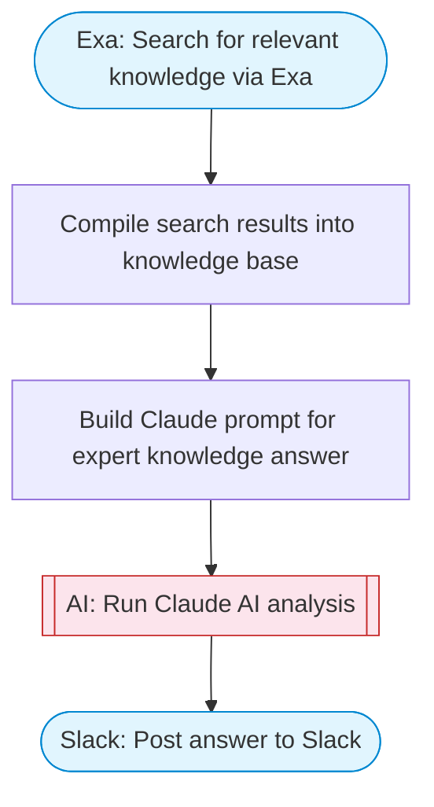

# AI chatbot with knowledge search

Adapted from the voice AI chatbot concept. Takes a user question, searches for relevant knowledge via Exa, uses Claude AI to synthesize a comprehensive expert answer, and delivers the response to Slack with Block Kit formatting.

> **Works with any AI agent.** Paste this page's URL into Claude Code, Codex, Cursor, Windsurf, OpenClaw, or any coding agent — it will read the docs, connect your platforms, and run this flow for you.

## Quick Start

```bash
# 1. Connect your platforms (one-time setup)
one add exa
one add slack

# 2. Run the flow
one flow execute n8n-4484-voice-chatbot-elevenlabs \
  --input question="your question here" \
  --input knowledgeDomain="..." \
  --input slackChannel="C01ABC123"
```

## Platforms

| Platform | Used for |
|----------|----------|
| Exa | Knowledge search |
| Slack | Posting the answer |

> Don't have these connected yet? Run `one list` to check, then `one add <platform>` to connect.

## What it does

1. Search for relevant knowledge via Exa
2. Compile search results into knowledge base
3. Build Claude prompt for expert knowledge answer
4. Run Claude AI analysis
5. Post answer to Slack

## Flow diagram



## Inputs

| Input | Required | Description |
|-------|----------|-------------|
| `question` | Yes | The user question to research and answer |
| `knowledgeDomain` | No | Domain to focus the search (e.g. 'technology', 'science', 'business', 'health') (default: general) |
| `slackChannel` | Yes | Slack channel ID to post the answer |

---

<sub>Based on [n8n #4484](https://n8n.io/workflows/4484) · 58.1K views on n8n · by [infranodus](https://n8n.io/creators/infranodus) · Converted to One CLI on 2026-03-25</sub>
