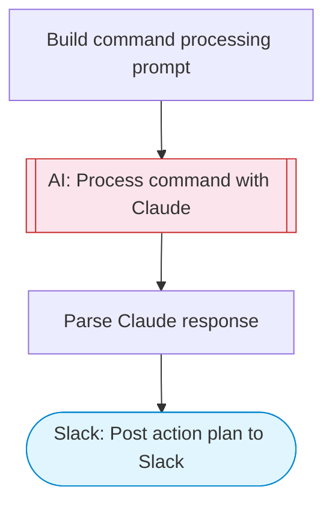

# Voice Command Processor

Process natural language voice commands into structured action plans using Claude AI and post the results to Slack. Adapted from the Siri AI Agent template for text-based command processing.

> **Works with any AI agent.** Paste this page's URL into Claude Code, Codex, Cursor, Windsurf, OpenClaw, or any coding agent — it will read the docs, connect your platforms, and run this flow for you.

## Quick Start

```bash
# 1. Connect your platforms (one-time setup)
one add slack

# 2. Run the flow
one flow execute n8n-2436-voice-command-processor \
  --input slackChannel="C01ABC123" \
  --input command="..." \
  --input userContext="..."
```

## Platforms

| Platform | Used for |
|----------|----------|
| Slack | Post action plan to Slack |

> Don't have these connected yet? Run `one list` to check, then `one add <platform>` to connect.

## What it does

1. Build command processing prompt
2. Process command with Claude
3. Parse Claude response
4. Post action plan to Slack

## Flow diagram



## Inputs

| Input | Required | Description |
|-------|----------|-------------|
| `slackChannel` | Yes | Slack channel ID to post the action plan |
| `command` | Yes | Natural language command to process (e.g. 'Schedule a team lunch for Friday and send invites to the marketing team') |
| `userContext` | No | Additional context about the user or environment (e.g. timezone, role, preferences) (default: ) |

---

<sub>Based on [n8n #2436](https://n8n.io/workflows/2436) · 33.6K views on n8n · by [max-n8n](https://n8n.io/creators/max-n8n) · Converted to One CLI on 2026-03-25</sub>
