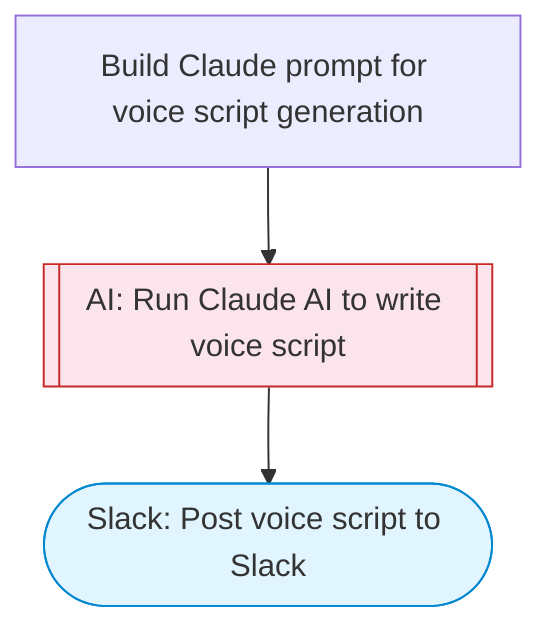

# Voice Script Writer — Claude generates speech-optimized scripts to Slack

Takes a topic or brief, uses Claude AI to write scripts optimized for text-to-speech delivery (natural pacing, pronunciation guides, SSML-friendly), and posts the finished script to Slack with Block Kit formatting.

> **Works with any AI agent.** Paste this page's URL into Claude Code, Codex, Cursor, Windsurf, OpenClaw, or any coding agent — it will read the docs, connect your platforms, and run this flow for you.

## Quick Start

```bash
# 1. Connect your platforms (one-time setup)
one add slack

# 2. Run the flow
one flow execute n8n-2245-voice-script-writer \
  --input slackChannel="C01ABC123" \
  --input topic="your topic here" \
  --input scriptType="..." \
  --input duration="..." \
  --input voiceStyle="..."
```

## Platforms

| Platform | Used for |
|----------|----------|
| Slack | Post voice script to Slack |

> Don't have these connected yet? Run `one list` to check, then `one add <platform>` to connect.

## What it does

1. Build Claude prompt for voice script generation
2. Run Claude AI to write voice script
3. Post voice script to Slack

## Flow diagram



## Inputs

| Input | Required | Description |
|-------|----------|-------------|
| `slackChannel` | Yes | Slack channel ID to post the script |
| `topic` | Yes | Topic or brief for the voice script (e.g. 'Product launch announcement for a new AI tool') |
| `scriptType` | No | Script type: narration, podcast-intro, explainer, advertisement, announcement (default: narration) |
| `duration` | No | Target duration for the voice script (e.g. '30 seconds', '2 minutes') (default: 60 seconds) |
| `voiceStyle` | No | Desired voice delivery style (e.g. energetic, calm, authoritative) (default: warm and conversational) |

---

<sub>Based on [n8n #2245](https://n8n.io/workflows/2245) · 40.5K views on n8n · by [n8ninja](https://n8n.io/creators/n8ninja) · Converted to One CLI on 2026-03-25</sub>
