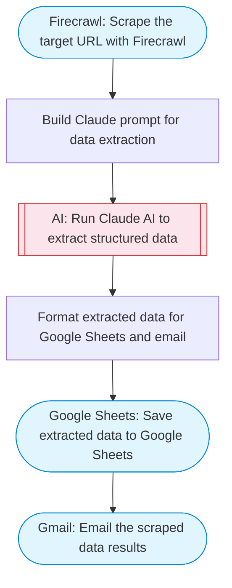

# Automated web scraping: email a CSV, save to Google Sheets & Microsoft Excel

Scrapes a target URL with Firecrawl, uses Claude AI to extract structured data (e.g. product listings, business info), emails the results via Gmail, and saves them to a new Google Sheets spreadsheet.

> **Works with any AI agent.** Paste this page's URL into Claude Code, Codex, Cursor, Windsurf, OpenClaw, or any coding agent — it will read the docs, connect your platforms, and run this flow for you.

## Quick Start

```bash
# 1. Connect your platforms (one-time setup)
one add firecrawl
one add google-sheets
one add gmail

# 2. Run the flow
one flow execute n8n-2275-web-scraping-email \
  --input url="https://example.com" \
  --input recipientEmail="user@example.com"
```

## Platforms

| Platform | Used for |
|----------|----------|
| Firecrawl | Scrape the target URL with Firecrawl |
| Google Sheets | Connection key |
| Gmail | Email the scraped data results |

> Don't have these connected yet? Run `one list` to check, then `one add <platform>` to connect.

## What it does

1. Scrape the target URL with Firecrawl
2. Build Claude prompt for data extraction
3. Run Claude AI to extract structured data
4. Format extracted data for Google Sheets and email
5. Save extracted data to Google Sheets
6. Email the scraped data results

## Flow diagram



## Inputs

| Input | Required | Description |
|-------|----------|-------------|
| `url` | Yes | URL to scrape (e.g. https://books.toscrape.com) |
| `recipientEmail` | Yes | Email address to receive the scraped data |

---

<sub>Based on [n8n #2275](https://n8n.io/workflows/2275) · 126.1K views on n8n · by [mihailtd](https://n8n.io/creators/mihailtd) · Converted to One CLI on 2026-03-24</sub>
