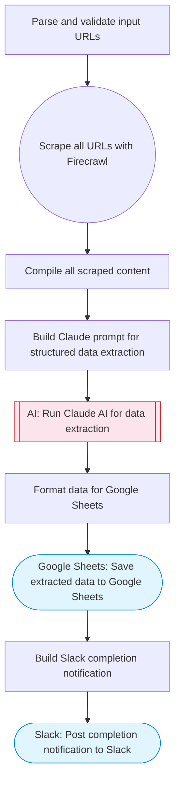

# Web scraping to Sheets: scrape URLs, AI structures data, save to Sheets

Scrapes one or more URLs using Firecrawl, uses Claude AI to extract and structure the data into a clean tabular format, and saves the results to a new Google Sheets spreadsheet.

> **Works with any AI agent.** Paste this page's URL into Claude Code, Codex, Cursor, Windsurf, OpenClaw, or any coding agent — it will read the docs, connect your platforms, and run this flow for you.

## Quick Start

```bash
# 1. Connect your platforms (one-time setup)
one add firecrawl
one add google-sheets
one add slack

# 2. Run the flow
one flow execute n8n-2552-web-scraping-jina-sheets \
  --input slackChannel="C01ABC123" \
  --input urls="https://example.com" \
  --input dataDescription="..." \
  --input sheetTitle="..."
```

## Platforms

| Platform | Used for |
|----------|----------|
| Firecrawl | Web scraping |
| Google Sheets | Saving data |
| Slack | Status notification |

> Don't have these connected yet? Run `one list` to check, then `one add <platform>` to connect.

## What it does

1. Parse and validate input URLs
2. Scrape all URLs with Firecrawl
3. Compile all scraped content
4. Build Claude prompt for structured data extraction
5. Run Claude AI for data extraction
6. Format data for Google Sheets
7. Save extracted data to Google Sheets
8. Build Slack completion notification
9. Post completion notification to Slack

## Flow diagram



## Inputs

| Input | Required | Description |
|-------|----------|-------------|
| `slackChannel` | Yes | Slack channel for completion notification |
| `urls` | Yes | Comma-separated URLs to scrape (e.g. 'https://example.com/products, https://example.com/pricing') |
| `dataDescription` | No | What data to extract (e.g. 'product names and prices', 'company names and contact info', 'article titles and dates') (default: all structured data items) |
| `sheetTitle` | No | Title for the Google Sheets spreadsheet (default: Scraped Data) |

---

<sub>Based on [n8n #2552](https://n8n.io/workflows/2552) · 51.3K views on n8n · by [derekcheungsa](https://n8n.io/creators/derekcheungsa) · Converted to One CLI on 2026-03-25</sub>
